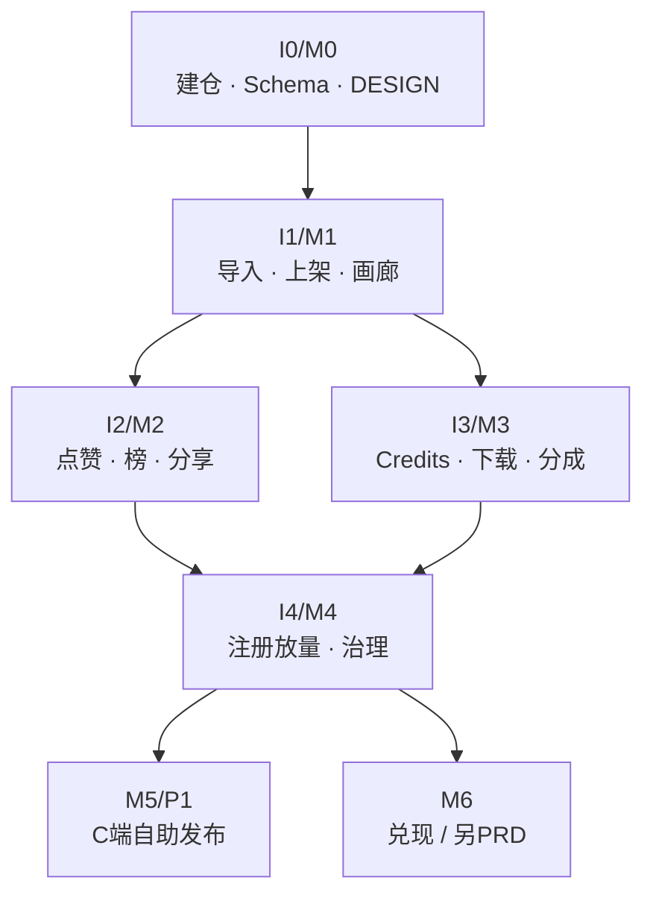
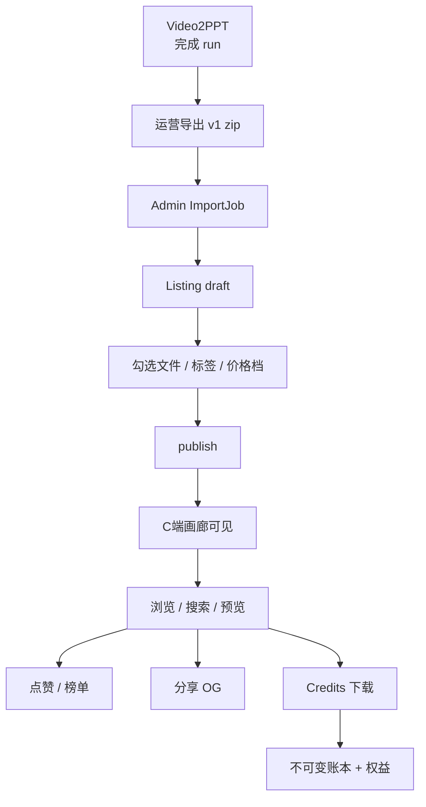
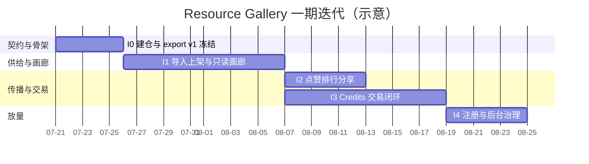
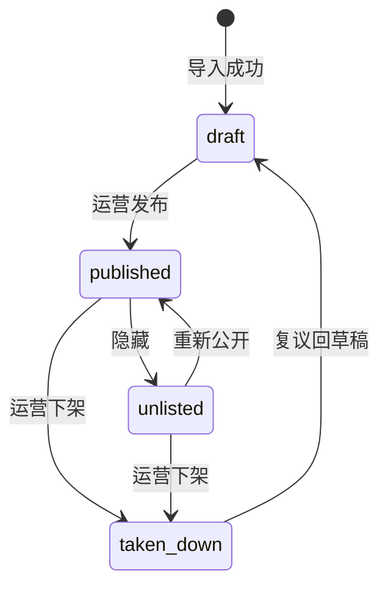
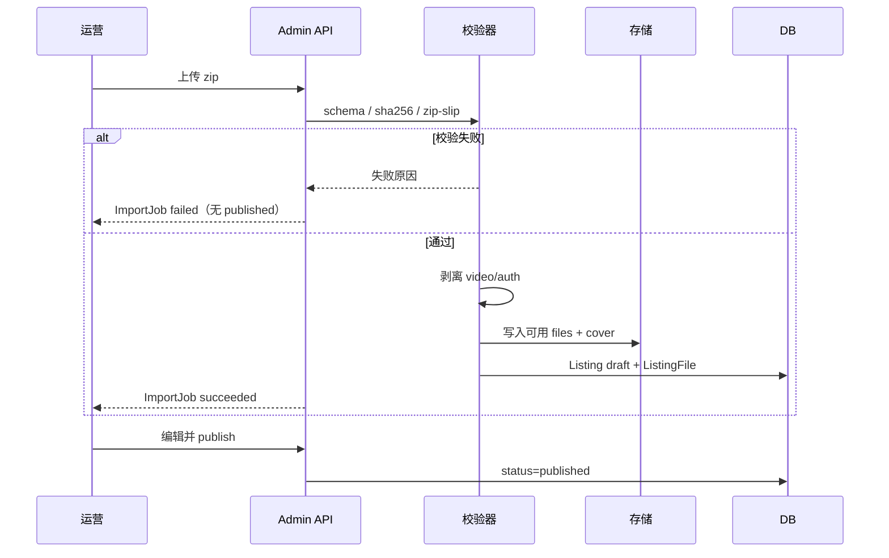
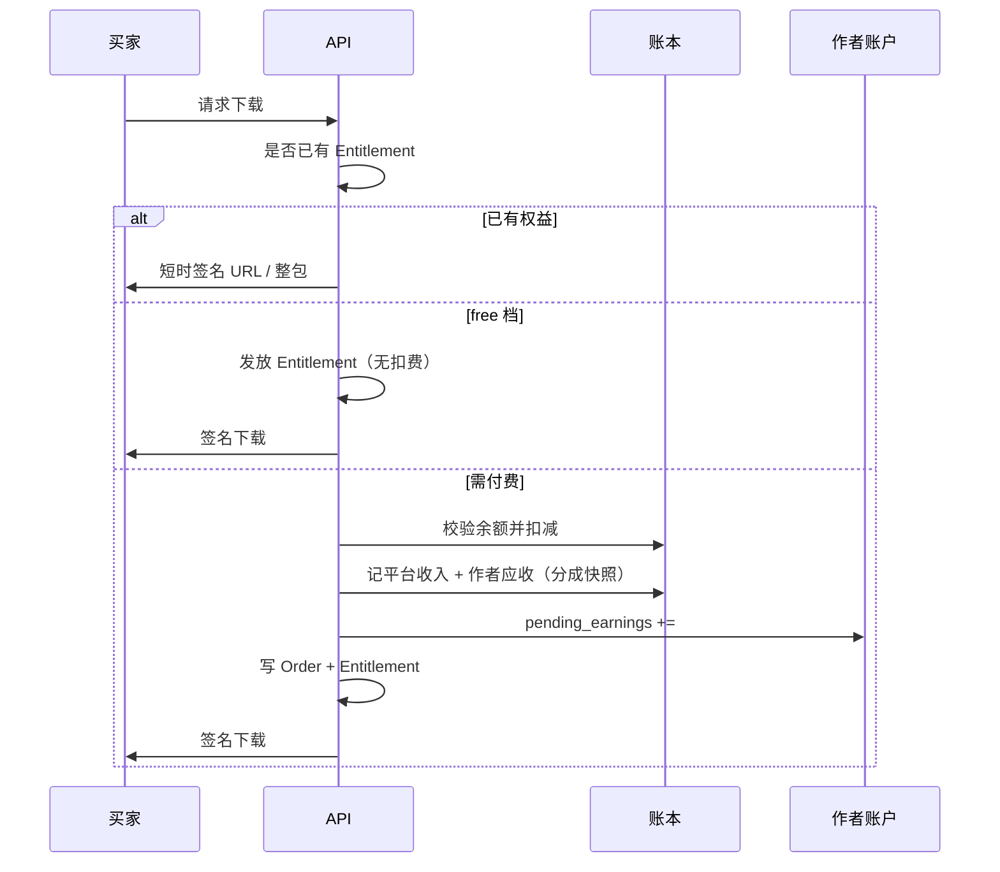
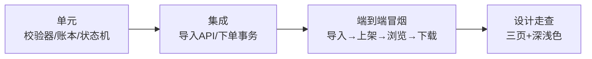
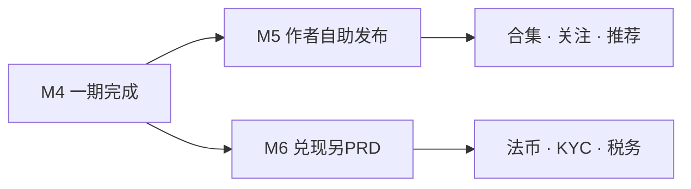
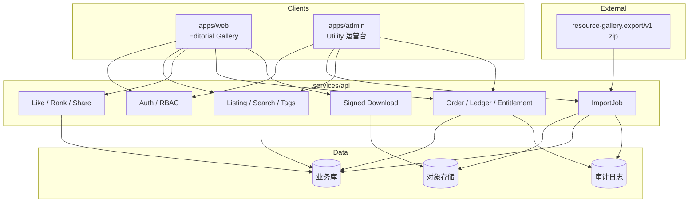

# Resource Gallery 迭代开发计划

## 1. 文档信息

| 项目 | 内容 |
|------|------|
| 产品名称 | Resource Gallery（资源站） |
| 文档类型 | 迭代开发计划（Implementation Roadmap） |
| 版本 | v0.1.0 |
| 日期 | 2026-07-19 |
| 状态 | 草案，对齐 PRD v0.1.1-draft |
| 上游 PRD | [docs/2026-07-19-resource-gallery-prd.md](./2026-07-19-resource-gallery-prd.md) |
| 范围 | 一期 **M0–M4**（仅运营导入；不做 C 端自助发布、不做法币兑现） |
| 读者 | 产品 / 设计 / 研发 / 运营 |

### 1.1 计划原则

1. **PRD 是需求源，本计划是执行拆分**：不重复展开背景与产品故事，只回答「按什么顺序做、每期交付什么、如何验收、何时止损」。
2. **契约与安全先于交易**：先冻结 `resource-gallery.export/v1` 与权限边界，再做画廊与 Credits。
3. **每期必须有可演示纵向切片**：不是「只写后端一半」，而是运营可导入 → 用户可看到结果（M1 起）。
4. **一期硬约束**：C 端无发布入口；公网只收导出包；不做提现/KYC/Pipeline。
5. **技术栈本计划不锁死**；要求前后端可独立部署、支持签名下载与不可变账本。

### 1.2 已锁定决策（继承 PRD §1.1）

| 决策 | 锁定值 |
|------|--------|
| 组织形态 | 独立仓 `resource-gallery`，兄弟于 Video2PPT |
| 一期供给 | 仅运营导入 `resource-gallery.export/v1` zip |
| 上架粒度 | 单次 Pipeline run → 一个 Listing |
| 定价 | 平台统一定价档位；作者不调价 |
| Credits | 完整账本 + 分成快照；兑现后置 |
| 审美 | Editorial Gallery；C 端与 Admin 皮肤分离 |

---

## 2. 目标与成功定义

### 2.1 一期总目标

在 **独立仓库、独立部署** 下，交付一个可运营冷启动的资源画廊：

- 运营可从 Video2PPT run 导出包导入并上架；
- 用户可浏览、检索、预览、点赞、分享；
- 注册用户可用 Credits 付费下载，账本与分成可审计；
- 默认不泄露源视频、cookies、认证材料。

### 2.2 一期 Definition of Done（汇总）

| 维度 | 完成标准 |
|------|----------|
| 供给 | 至少 1 个样例 v1 包可导入 → draft → published |
| 发现 | 首页 / 搜索 / 主题 / 详情预览可用，设计门禁通过 |
| 互动 | 点赞、日周总榜、分享 OG 可用 |
| 交易 | free/standard 下载路径正确；重复下载不重复扣费；分成快照生效 |
| 权限 | 普通用户调用导入/发布 API → 403；C 端无发布入口 |
| 边界 | 代码与部署不依赖 Video2PPT 进程内模块 |

### 2.3 明确不做（本期计划外）

- M5：C 端自助发布、作者工作台、「一键导出并发布」客户端入口
- M6：法币充值 / 提现 / KYC / 税务
- 资源站内重跑 Pipeline、源视频市场、社交 Feed/IM、企业多租户

---

## 3. 总览：迭代地图

### 3.1 里程碑一览

| 迭代 | 名称 | 核心用户价值 | 关键交付 | 供给模式 | 建议工期* |
|------|------|--------------|----------|----------|-----------|
| **I0 / M0** | 建仓与契约冻结 | 研发可开工，导入格式不可漂 | 仓骨架、export schema、DESIGN tokens、校验 CLI | 无 | 3–5 天 |
| **I1 / M1** | 运营只读画廊 | 运营可上架，访客可看可搜 | 导入 → 标签 → 搜索 → 详情预览 + 三页高 taste UI | 仅运营导入 | 10–14 天 |
| **I2 / M2** | 互动与传播 | 内容可传播、可排序 | 点赞、排行、分享 OG | 仅运营导入 | 5–7 天 |
| **I3 / M3** | 交易闭环 | Credits 可买可记账 | 账本、定价档位、下载权益、分成快照、已购中心 | 仅运营导入 | 10–14 天 |
| **I4 / M4** | 注册放量与治理 | 可公开注册并运营治理 | 公开注册、频控/审计完善、后台治理 | 仍仅运营上架 | 5–7 天 |
| **P1 / M5+** | 作者与兑现 | 另立迭代，不并入一期 | 见 §9 | — | 后置 |

\*工期按 **1 名全栈 + 0.5 设计/运营协同** 估算，可随人力压缩或拉长；顺序不可逆。

### 3.2 依赖关系



说明：

- **M2 与 M3 可部分并行**（榜单缓存 vs 账本），但都依赖 M1 的 Listing/详情稳定。
- **M4 必须在 M2+M3 之后**：公开注册会放大互动刷量与交易对账风险。
- **M5/M6 禁止前移**：否则污染权限模型与合规范围。

### 3.3 端到端价值流（一期）



### 3.4 建议排期（甘特）



---

## 4. 功能 → 迭代映射

| PRD 功能 | 描述 | 首入迭代 | 备注 |
|----------|------|----------|------|
| 仓骨架 / 文档 | README、目录、边界说明 | I0 | PRD §15 |
| export v1 schema + fixture | 契约冻结 | I0 | PRD §10 |
| DESIGN tokens / DESIGN.md | Editorial Gallery | I0 | PRD §6 |
| 校验 CLI | `validate_export_package` | I0 | 防坏包 |
| F2 运营导入 | zip → ImportJob → draft | I1 | 一期唯一供给 |
| F3 运营上架 | 勾选文件 / 发布状态机 | I1 | draft→published… |
| F5 自动标签 | 规则优先 + 待确认 | I1 | LLM 补全可后置开关 |
| F4 浏览搜索 | 首页/主题/搜索 | I1 | |
| F6 详情预览 | 大预览 + 未购预览策略 | I1 | 下载完整包待 I3 |
| F12 管理后台（导入/上架） | Admin 导入与策展 | I1 | |
| F1 账户（最小） | Admin 登录 + 可选内部用户 | I1 | 公开注册延至 I4 |
| F7 点赞 | 一用户一资源 | I2 | 依赖登录用户 |
| F10 排行榜 | 点赞/下载 日周总 | I2 | 下载榜在 I3 才有真实数据 |
| F11 分享 | 短链 + OG | I2 | |
| F8 统一定价 | 价格档位配置 | I3 | |
| F9 付费下载与账本 | 扣费/权益/分成快照 | I3 | |
| F1 个人中心（已购/流水） | 买家视角 | I3 | 「我的发布」一期不做 |
| F12 调账/分成/下架完善 | 治理 | I3–I4 | |
| 公开注册 / 频控 / 审计 | 放量 | I4 | |
| C 端自助发布 | P1 | M5 | 一期禁止 |
| 法币兑现 | 另 PRD | M6 | 一期禁止 |

---

## 5. 分迭代详规

### 5.1 I0 / M0 — 建仓与契约冻结

**目标**  
让研发在正确边界内开工：仓存在、契约不可漂、设计 token 可引用。

**交付物**

| 路径/产物 | 说明 |
|-----------|------|
| 仓库骨架 | 对齐 PRD §15.2：`apps/`、`services/`、`packages/export-schema/`、`docs/`、`tools/` |
| `packages/export-schema` | `resource-gallery.export.v1.json` + ≥1 正例 fixture + ≥1 负例（zip slip / 缺字段 / 全 video） |
| `tools/validate_export_package` | CLI：校验 schema、sha256、路径安全、剥离策略后可用文件数 |
| `docs/export-contract.md` | 从 PRD §10 抽出的实施详规 |
| `docs/DESIGN.md` | 字体/色 token/布局/反模式清单（可验收） |
| `docs/ops-runbook.md` | 导出 → 导入 → 上架 操作骨架（I1 补全截图） |
| `README.md` | 与 Video2PPT 边界、本地启动占位、一期不做列表 |
| CI | 至少跑 schema fixture 校验 |

**任务拆解**

1. 初始化 monorepo/多应用目录与 `.gitignore`（无密钥）。
2. 冻结 export v1 JSON Schema 与类型（TS 或共享 JSON）。
3. 实现校验 CLI + 单元/夹具测试。
4. 起草 DESIGN tokens 与 C 端/Admin 皮肤分层约定。
5. 写 ops-runbook 流程骨架与审计字段清单。

**验收标准（DoD）**

- [ ] 空仓可克隆；README 写清「不反向写 Video2PPT」。
- [ ] 合法 fixture 校验通过；非法路径 / 错误 schema / 剥离后 0 文件 → 失败。
- [ ] CI 对 schema fixture 绿灯。
- [ ] DESIGN.md 含 token 表 + 十条设计验收引用。
- [ ] 仓库内无业务密钥、无本机绝对路径硬编码。

**止损线**

- 若 export 字段仍与 Video2PPT 真实产物对不上：暂停写业务 API，先对齐导出器样例包（可在 Video2PPT 仓另开导出器任务）。
- 若强行在 Video2PPT 主仓塞市场逻辑：否决，回到独立仓。

**风险**

| 风险 | 缓解 |
|------|------|
| 无真实 zip 样例导致契约空想 | I0 结束前必须有 1 个手搓或导出器生成的真实包 |
| 技术栈争论拖期 | I0 只锁契约与目录；栈在 I1 开工前 0.5 天决策即可 |

---

### 5.2 I1 / M1 — 运营只读画廊

**目标**  
完成「运营导入 → 上架 → 访客浏览检索预览」闭环；C 端呈现 Editorial Gallery，而非 SaaS 后台。

**用户故事（本期）**

1. 作为运营，我上传 v1 zip，得到 Listing 草稿并可编辑后发布。
2. 作为访客，我在首页/主题/搜索中找到资源并查看预览与摘要。
3. 作为系统，我拒绝危险文件与半成品 published。

**交付物**

| 模块 | 内容 |
|------|------|
| API | `POST /admin/import-jobs`、导入状态查询、`POST /admin/listings/{id}/publish`、Listing CRUD（admin）、公开 Listing 列表/详情/搜索 |
| 领域模型 | User(admin)、ImportJob、Listing、ListingFile、Topic/Tag |
| 导入管线 | 解压 → 校验 → 剥离 video/auth → 落库 draft → 审计日志 |
| 标签 | 规则词典 → 主题；低置信度「待确认」；上架前可改 |
| C 端三页 | 首页（英雄句+精选网格）、搜索/主题结果、详情（大预览+窄信息栏，购买栏可占位） |
| Admin | 导入任务列表、草稿策展（勾选文件/标题/摘要/标签/价格档占位）、发布/下架 |
| 存储 | 对象存储或本地 blob（dev）；封面策略：cover.png 或从 infographic/slide 生成 |
| 权限 | admin only 导入/发布；公开读 published；C 端无发布入口 |

**状态机（Listing）**



**导入时序**



**任务拆解**

1. 选定栈与基础工程（API + Web + Admin 同应用分路由或分 app，皮肤分离）。
2. 实现 ImportJob 异步处理与幂等键 `source_task_id + source_run_id`。
3. 实现 Listing 状态机与默认文件勾选策略（PRD §8.1 F3）。
4. 实现公开浏览/搜索/主题筛选与详情未购预览（PDF 前 N 页 / 信息图 / Markdown 前段；N 暂默认 3，可配）。
5. 规则标签 + 运营校正；「其他」兜底。
6. C 端三页按 DESIGN 落地；Admin Utility 皮肤。
7. 种子内容：≥3 个真实导出包走通导入上架。

**验收标准（DoD）**

- [ ] 样例包导入 → draft → published，C 端可见。
- [ ] 关键词/标签可检索到该资源。
- [ ] 含源视频的包：自动剥离并记审计；剥离后无文件则拒绝；**发布清单无 video/auth**。
- [ ] 失败导入不留下 published 半成品。
- [ ] 普通用户/匿名调用导入发布 API → 403。
- [ ] C 端导航无「发布」「上传」。
- [ ] 设计门禁：首屏封面主导、无表格感后台；与 Video2PPT 工具页可一眼区分。
- [ ] 重复导入同一 task+run：更新草稿，不复制已发布条目（与 PRD 一致）。

**止损线**

- 预览实现若阻塞：可先做「封面 + 摘要 + 文件列表元数据」，PDF 多页预览可 spiking 不超过 2 天，超时降级为首页图。
- 自动标签准确率不以 100% 为门禁；「待确认 + 人工改」必须可用。

**风险**

| 风险 | 缓解 |
|------|------|
| 大包上传超时 | 限 `max_package_bytes`；异步 Job；分块可后置 |
| 审美走样 | 设计验收 checklist 进 PR；反模式清单硬拦 |
| 本机路径误用 | 公网配置禁止 tasks 绝对路径；只收 zip |

---

### 5.3 I2 / M2 — 互动与传播

**目标**  
让已上架内容可被点赞、上榜、外链分享；为冷启动传播服务。

**前提**  
I1 的 Listing 详情与（至少内部）登录用户可用。若 I4 前无公开注册，可用邀请码/白名单用户测点赞。

**交付物**

| 模块 | 内容 |
|------|------|
| Like | 用户×Listing 唯一；取消点赞策略（建议支持取消） |
| 计数 | `like_count` 冗余 + 事件校正任务预留 |
| 排行榜 | 点赞榜：日 / 周 / 总；下载榜 UI 先接计数（真实交易数据在 I3） |
| 分享 | `ShareLink` 短链；OG 大封面 + 短标题 + 字标 |
| 页面 | 榜单页（杂志榜单气质）；详情点赞反馈动效（克制） |
| 防刷预留 | 频控中间件、异常账号标记字段（规则可先简单） |

**任务拆解**

1. Like API + 幂等约束。
2. 榜单查询与缓存（TTL 可配）。
3. 分享页与 OG meta；未登录仅摘要+封面。
4. C 端榜单与详情点赞交互。
5. 基础频控（IP/用户维度）。

**验收标准（DoD）**

- [ ] 登录点赞后榜单数据正确变化；重复点赞不重复计数。
- [ ] 分享链接未登录可看摘要与封面，不可下完整包。
- [ ] 榜单视觉非游戏战绩风。
- [ ] 未登录点赞被拒绝并引导登录（文案克制）。

**止损线**

- 复杂反作弊算法不进 I2；有频控与审计字段即可。
- OG 图片生成失败时回退默认封面，不阻塞分享链接。

---

### 5.4 I3 / M3 — Credits 交易闭环

**目标**  
平台统一定价下完成「余额 → 下单 → 账本 → 权益 → 签名下载」，作者侧可见 `pending_earnings`（暂不可兑现）。

**领域对象**

| 对象 | 职责 |
|------|------|
| PriceTier | free / standard / premium 等可配 credits |
| CreditAccount | balance、pending_earnings |
| LedgerEntry | 只追加流水 |
| Order | 成交快照：价格、分成 bps、档位 |
| RevenueShareConfig | 版本化分成；新单用新版 |
| DownloadEntitlement | 已购/免费授予；建议 MVP 永久 |

**下载与记账时序**



**任务拆解**

1. 账户与账本模型；流水不可变、退款走反向流水。
2. 价格档位 Admin 配置；Listing 绑定档位。
3. 下单事务：扣费 + Order 快照 + Entitlement 同事务。
4. 签名下载 URL（短时 TTL）；整包 zip 或单文件。
5. 自己下载自己的资源：免费且不计入下载交易榜。
6. 个人中心：余额、流水、已购、pending_earnings 说明（明确「暂不可兑现」）。
7. Admin：赠送/调账、分成版本变更、下架后权益策略（已购是否仍可下——默认仍可）。
8. 下载计数与下载榜真实数据接通。

**验收标准（DoD）**

- [ ] free 档可直接下载；standard 扣 credits 后可下；重复下载不重复扣费。
- [ ] 修改分成比例后，**仅新订单**用新比例；历史 Order 快照不变。
- [ ] 作者/运营账号可见 `pending_earnings`；UI 标明不可兑现。
- [ ] 未购用户无法拿到完整文件直链（抓包可见仅短时签名或 403）。
- [ ] 账本可对账：余额变动 = 流水合计。
- [ ] 自己下自己的资源不计下载交易榜。

**止损线**

- 不做提现、不做法币锚定、不做复杂促销引擎。
- 若分布式事务复杂：单库事务优先；对象存储失败要有补偿或重试，不得出现「扣了费无无权益」。

**风险**

| 风险 | 缓解 |
|------|------|
| 并发双花 | 余额乐观锁/行锁；订单幂等键 |
| 扣费成功打包失败 | 事务边界清晰；失败回滚或自动退款流水 |
| Credits 无兑现伤激励 | 运营赠送与曝光策略；路线图写清 M6 |

---

### 5.5 I4 / M4 — 注册放量与后台治理

**目标**  
在交易与互动闭环已稳的前提下，开放公开注册浏览/下载，并补齐运营治理与安全加固。

**交付物**

| 模块 | 内容 |
|------|------|
| 注册登录 | 邮箱或手机二选一先落地一种，模型兼容另一种 |
| 个人中心完整化 | 资料、已购、点赞、流水、余额 |
| 后台治理 | 用户管理、举报/下架、调账审计查询、导入审计 |
| 安全 | 注册/登录/点赞/下载频控；管理操作全量审计 |
| 合规文案 | 授权声明、用户协议入口、侵权下架说明 |
| 可观测 | 基础错误日志、导入失败率、下单失败率 |
| 性能 | 列表分页、榜单缓存、图片懒加载、封面裁切策略固化 |

**权限矩阵（冻结复核）**

| 角色 | 浏览 | 点赞 | 付费下载 | 上传导出包 | 编辑/上架 | 调账/分成 |
|------|------|------|----------|------------|-----------|-----------|
| 匿名 | 摘要/封面 | 否 | 否 | 否 | 否 | 否 |
| 注册用户 | 是 | 是 | 是 | **否** | **否** | 否 |
| 管理员 | 是 | 是 | 是 | **是** | **是** | 是 |

**验收标准（DoD）**

- [ ] 公开注册后，新用户可完成：浏览 → 点赞 →（获赠或测试 credits）→ 下载。
- [ ] 注册用户仍 **无** 自助发布入口；相关 API 403。
- [ ] 管理调账、分成变更、下架有审计日志可查。
- [ ] 基础频控生效（可用压测脚本或手动超限验证）。
- [ ] PRD §14.1 功能验收 1–10 与 §14.2 设计验收 1–5 全部勾选。

**止损线**

- 发现系统性账本不一致或签名 URL 可被枚举：暂停公开注册，回滚到白名单。
- 不在本迭代「顺便」做 C 端发布。

---

## 6. 跨迭代工程约定

### 6.1 建议仓库目录（实施时创建）

```text
resource-gallery/
├── README.md
├── docs/
│   ├── 2026-07-19-resource-gallery-prd.md
│   ├── 2026-07-19-resource-gallery-iteration-plan.md  # 本文
│   ├── DESIGN.md
│   ├── export-contract.md
│   └── ops-runbook.md
├── packages/
│   └── export-schema/
├── apps/
│   ├── web/          # C 端画廊
│   └── admin/        # 可与 web 同应用分路由
├── services/
│   └── api/
└── tools/
    └── validate_export_package/
```

### 6.2 质量门禁（每迭代合并前）

| 门禁 | 要求 |
|------|------|
| 契约 | 破坏性变更必须升 export `v2`，禁止默默改 v1 语义 |
| 安全 | 新增下载路径必须过「未购不可直链」检查 |
| 权限 | 变更 admin 能力必须更新权限矩阵测试 |
| 设计 | C 端 PR 附截图；对照 PRD §6.3 / §14.2 |
| 数据 | 账本相关变更必须有对账用例 |
| 密钥 | CI 与镜像无 cookies/API key |

### 6.3 测试策略（按层）



- **I0**：夹具与 CLI 为主。  
- **I1**：导入 E2E + 公开读 API + 视觉走查。  
- **I2**：点赞幂等 + OG 响应头。  
- **I3**：账本对账 + 并发下单 + 签名过期。  
- **I4**：注册流 + 403 矩阵 + 频控。

### 6.4 与 Video2PPT 的协作边界

| 系统 | 本期要做 | 本期不做 |
|------|----------|----------|
| Video2PPT | 可选：`export_run_package` 工具，产出 v1 zip | 市场 UI、Credits、公网 Listing |
| resource-gallery | 校验、入库、画廊、账本 | Pipeline、Whisper、扫本机 tasks |
| 契约 | 共同遵守 v1 | 互相写对方业务状态 |

导出器可与 I0/I1 **并行**在 Video2PPT 仓推进；资源站侧不得因导出器未就绪而跳过校验 CLI（可用手搓 fixture）。

---

## 7. 人员与节奏建议

| 角色 | 职责 | 介入迭代 |
|------|------|----------|
| 全栈研发 | API、导入、账本、前后端 | 全程 |
| 设计 | DESIGN.md、C 端三页与榜单、深浅色 | I0–I2 重点 |
| 运营 | 样例包、上架流程、标签词典、种子内容 | I1 起 |
| 产品 | 验收门禁、开放问题拍板 | 每迭代 Demo |

**节奏建议**：每迭代结束固定 **Demo + 验收勾选表**；未过 DoD 不进入下一迭代主开发（允许修 bug 热修）。

---

## 8. 风险、依赖与开放问题

### 8.1 主要风险登记

| ID | 风险 | 影响迭代 | 缓解 | 升级条件 |
|----|------|----------|------|----------|
| R1 | 衍生作品版权争议 | I1+ | 授权勾选、下架流程、默认无源片 | 投诉量上升 → 加强审核队列 |
| R2 | 标签噪声 | I1 | 规则优先 + 待确认 | 搜索差评 → 加运营批处理工具 |
| R3 | 本机路径导入误用到公网 | I1 | 只收 zip；配置校验 | 发现路径配置 → 紧急下线导入 |
| R4 | 账本并发/对账错误 | I3 | 单库事务、幂等、对账测试 | 任何资损 → 停交易 |
| R5 | 审美执行成 SaaS 模板 | I1–I2 | 设计门禁 + 反模式 | 设计验收失败不合并 |
| R6 | Credits 无兑现激励不足 | I3–I4 | 运营激励、透明路线图 | 供给不足 → 提前规划 M5/M6 而非削弱安全 |

### 8.2 外部依赖

1. Video2PPT 可导出或手搓的 **真实 v1 样例包**（阻塞 I1 端到端）。  
2. 对象存储 / CDN（生产签名下载；dev 可本地）。  
3. 邮件或短信通道（I4 注册；I1 可用密码+邀请码绕过）。  
4. 域名与品牌中文名（不阻塞功能，阻塞正式对外）。

### 8.3 开放问题（不阻塞一期开工）

| # | 问题 | 建议默认 | 最晚决策点 |
|---|------|----------|------------|
| 1 | 中文品牌名与域名 | 对外暂用 Resource Gallery | I4 公开前 |
| 2 | 注册先邮箱还是手机 | 先邮箱 | I4 开工前 |
| 3 | 下载权是否永久 | 是 | I3 开工前 |
| 4 | PDF 未购预览页数 N | 3 | I1 详情开发前 |
| 5 | 含源视频包：剥离 vs 硬拒绝 | 剥离；0 文件则拒绝 | I0 契约已倾向此策略 |
| 6 | web/admin 同应用 vs 分应用 | 同应用分路由 + 皮肤分离 | I1 工程初始化前 |

---

## 9. 一期之后（仅指路，不排期承诺）



| 阶段 | 触发条件（建议） | 内容 |
|------|------------------|------|
| M5 | 种子内容 ≥ N、导入流程稳定、403 矩阵无回退 | C 端发布台、我的发布、权属加强；可选 Video2PPT 一键发布 API 客户端 |
| M6 | 法务/合规评审通过 | 提现、KYC、汇率与结算；**新 PRD** |
| 其他 P1 | 数据证明需要 | 评论、合集、关注、有限调价、多语言、非 V2P 合规包 |

---

## 10. 每迭代验收勾选总表（执行用）

### I0

- [ ] 仓骨架与 README 边界
- [ ] export v1 schema + 正负 fixture
- [ ] 校验 CLI / CI
- [ ] DESIGN.md token
- [ ] ops-runbook 骨架

### I1

- [ ] 导入 → draft → published
- [ ] 搜索/主题/详情预览
- [ ] 危险文件剥离或拒绝
- [ ] C 端无发布入口 + API 403
- [ ] 设计三页走查通过
- [ ] ≥3 种子 Listing

### I2

- [ ] 点赞幂等与榜单
- [ ] 分享 OG / 未登录边界
- [ ] 基础频控

### I3

- [ ] free/standard 下载路径
- [ ] 重复下载不重复扣费
- [ ] 分成快照与 pending_earnings
- [ ] 签名 URL 与未购隔离
- [ ] 账本对账用例通过

### I4

- [ ] 公开注册全链路
- [ ] 治理与审计
- [ ] PRD §14 全量验收
- [ ] 一期硬约束复查（无 C 端发布、无提现）

---

## 11. 建议立即执行的下一步（开工清单）

按优先级：

1. **确认 I0 工程初始化**：目录骨架 + 技术栈拍板（0.5 天内）。  
2. **冻结 export v1**：schema + 1 个真实/半真实 fixture zip。  
3. **并行**：Video2PPT 侧导出器（若尚未有）与 `docs/DESIGN.md` 视觉 token。  
4. **I1 第一刀**：ImportJob + Listing draft API，再挂 C 端只读首页。  
5. 每迭代结束用 §10 勾选表做 Demo，不通过不进入下一主迭代。

---

## 12. 文档维护

| 变更类型 | 动作 |
|----------|------|
| PRD 决策变更（合仓、开放 C 端发布、schema 大版本、提现提前） | 先改 PRD 决策表升版，再改本计划映射与硬约束 |
| 仅工期/人力调整 | 改本计划甘特与工期表，版本 +0.0.1 |
| 迭代 DoD 增删 | 改对应章节与 §10 总表，注明原因 |
| 独立仓实施源 | 建仓后可将本文同步为 `docs/ITERATION_PLAN.md`，与 PRD 一并维护 |

**版本记录**

| 版本 | 日期 | 说明 |
|------|------|------|
| v0.1.0 | 2026-07-19 | 首版：对齐 PRD v0.1.1-draft，覆盖 M0–M4 执行拆分 |

---

## 13. 附录：一期架构示意



---

*本文是执行计划，不是第二份 PRD。需求冲突时以 PRD 决策记录为准；执行顺序与验收拆分以本文为准。*
