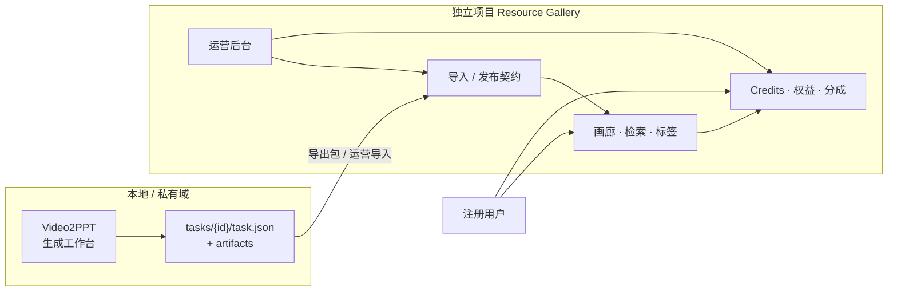
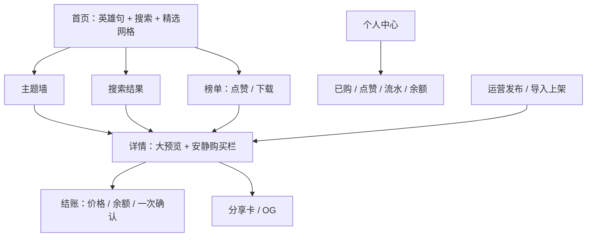
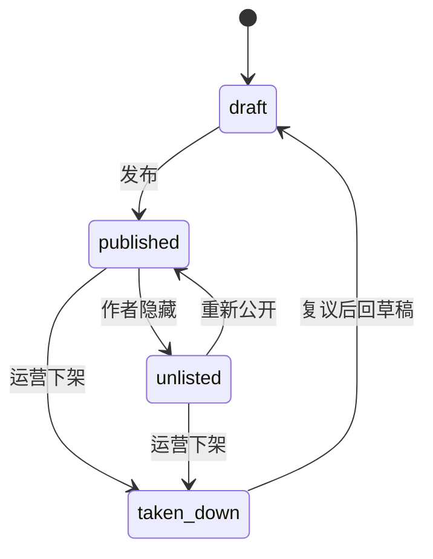
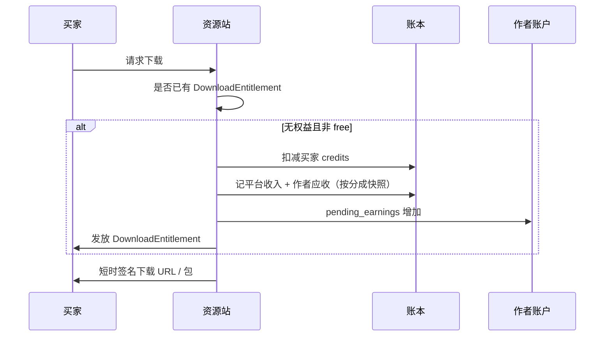
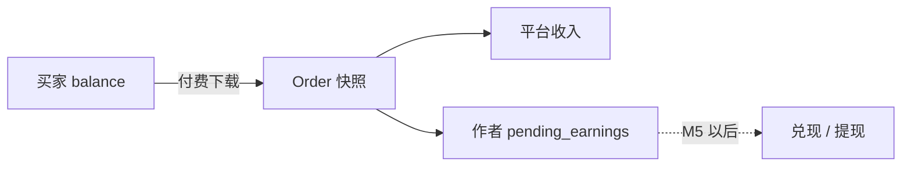
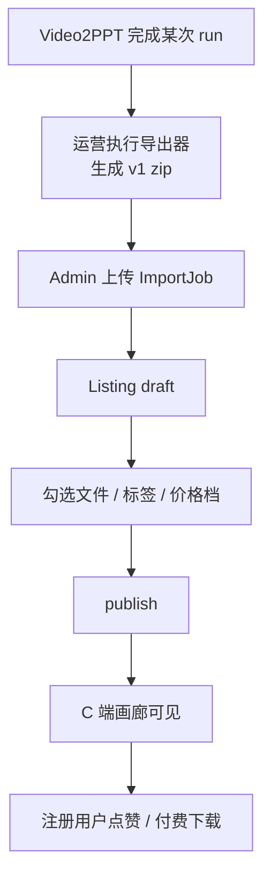

# Resource Gallery（资源站）产品需求文档

## 1. 文档信息

| 项目 | 内容 |
|------|------|
| 产品名称 | Resource Gallery（资源站） |
| 暂定英文名 | Resource Gallery |
| 文档类型 | 产品需求文档（PRD） |
| 版本 | v0.1.1-draft |
| 日期 | 2026-07-19 |
| 状态 | 草案，已锁定独立建仓、仓名、export v1、一期仅运营导入 |
| 上游关联 | 本地 Video2PPT 生成工作台（产物源，不负责公网交易） |
| 文档路径 | `docs/plans/2026-07-19-resource-gallery-prd.md` |
| 读者 | 产品 / 设计 / 研发 / 运营 |

### 1.1 决策记录

| 决策项 | 选择 | 说明 |
|--------|------|------|
| 项目组织 | **独立新产品 / 独立仓库** | 仓库名与目录见 §15；不内嵌 Video2PPT 主仓 |
| 仓库名 | **`resource-gallery`** | 建议远程 `caiqing/resource-gallery`；本地 `Documents/agents/github/resource-gallery` |
| MVP 范围 | 浏览检索 + 运营上架下载 | Credits 站内闭环；不做真实法币充值/提现 |
| 一期供给 | **仅运营导入上架** | 暂不开放 C 端自助发布；注册用户可浏览/点赞/下载 |
| 上架粒度 | **Video2PPT 主任务（`task_id`）** | 一个任务对应一个 Listing；内部批次仅用于恢复和审计 |
| 分享包形态 | 任务级聚合包，运营勾选文件 | 可合并连续恢复批次，必须包含 PPT 与信息图 |
| 初始内容 | Video2PPT 任务级导出包导入 | 唯一供给路径：管理员上传 `resource-gallery.export/v1` zip |
| 账户模型 | 邮箱/手机注册；作者与买家一体 | 管理员角色另设 |
| 定价 | 平台统一定价档位 | 作者不调价；仍参与分成收益 |
| Credits | 完整账本 + 分成配置 + 作者应收 | 现金兑现仅写后续阶段 |
| 审美方向 | Editorial Gallery | 内容画廊优先，交易信息次级 |
| 品牌关系 | 独立品牌，弱关联 Video2PPT | 不复用本地工作台视觉语言 |

---

> 2026-07-22 增量决策：Resource Gallery 不面向用户展示 Pipeline run。本文后续仍出现的 `run_id` / `run_index` 仅表示 v1 契约兼容和内部审计 provenance；Listing 身份、重复导入和公开体验均以 `task_id` 为准。

## 2. 背景与问题

Video2PPT 已能把视频、网页、文档等多来源稳定转为 PPT、信息图、蓝图与中间文稿，并在本地任务目录中沉淀大量高质量产物。但这些资产目前存在于：

- 本机任务详情页，难以被他人发现；
- 以文件与运行版本形式散落，缺少主题聚类与检索；
- 没有分享、排行、复用与价值交换闭环。

结果是：**生成能力强，分发与复用能力弱**。  
用户完成一次优质生成后，资产停留在私人工作台，无法形成“可浏览、可信任下载、可激励创作者”的网络效应。

资源站要解决的不是“再做一个生成器”，而是：

> 把 Video2PPT 的运行版本产物，变成可发现、可分类、可分享、可用 Credits 交换的知识资产。

---

## 3. 产品定位

### 3.1 是什么

Resource Gallery 是一个 **独立的分类资源站点**：面向 AI 生成的演示文稿、信息图与结构化文稿资产，提供：

- 按主题 / 任务 / 标签聚类展示；
- 内容自动打标与人工校正；
- 搜索、点赞、下载排行；
- 用户分享传播与 Credits 下载；一期内容由运营上架；
- 平台统一定价下的 Credits 付费下载；
- 作者收益记账与后台分成配置。

### 3.2 不是什么

- 不是 Video2PPT 云端版，不负责视频下载、Whisper、NotebookLM Pipeline。
- 不是源视频分发平台，默认不公开原始视频与登录态材料。
- 不是泛用网盘或素材站，聚焦“一次生成运行”的结构化知识包。
- 不是游戏化积分商城；Credits 是冷静的站内价值单位。

### 3.3 与 Video2PPT 的边界



**原则：**

1. 仓库独立、部署独立、设计系统独立、账户体系独立。  
2. Video2PPT 只产出；资源站只消费与分发。  
3. 资源站 **不反向写入** Video2PPT 的 `task.json` 或任务状态。  
4. 后续若 Video2PPT 增加“发布到资源站”，也只是调用资源站 API，不把市场逻辑塞进 Pipeline。

### 3.4 为什么必须独立建仓

| 维度 | Video2PPT | Resource Gallery |
|------|-----------|------------------|
| 用户模型 | 本机单用户工具 | 多用户注册、作者/买家 |
| 核心价值 | 确定性生成 Pipeline | 发现、策展、交易 |
| 数据敏感面 | cookies、Notebook 登录态、本机路径 | 公开元数据、签名下载、账本 |
| UI 气质 | 任务工作台 / 工具密度 | Editorial Gallery / 作品优先 |
| 发布节奏 | 生成可靠性迭代 | 内容运营与增长迭代 |

合仓会同时污染安全边界、信息架构与高 taste 审美，故 **否决作为 Video2PPT 子模块落地**。

---

## 4. 目标用户与场景

### 4.1 目标用户

- **创作者 / 讲师**：把优质 run 产物上架，获得 Credits 收益与传播。  
- **研究员 / 产品经理 / 运营**：按主题检索可复用的 PPT、信息图与结构化摘要。  
- **平台运营**：导入种子内容、配置价格档位与分成、处理下架与调账。  
- **早期种子作者**：平台用本机 Video2PPT 历史优质任务完成冷启动。

### 4.2 核心场景

1. **运营导入冷启动**：从 Video2PPT 导出若干完成态 run 包，批量生成 Listing 草稿并上架。  
2. **主题发现**：用户按“AI 工程 / 商业模式 …”进入主题墙，浏览封面网格。  
3. **搜索定位**：按关键词、标签、任务名找到目标资源。  
4. **预览决策**：查看信息图全图或 PDF 前几页、摘要与标签，决定是否付费。  
5. **Credits 下载**：扣费 → 记账 → 发放永久（或策略内）下载权 → 下载整包或单文件。  
6. **点赞与排行**：登录点赞；浏览点赞榜 / 下载榜。  
7. **分享传播**：生成公开短链与 OG 卡片，未登录可看摘要与封面。  
8. **运营发布（一期）**：管理员导入 run 导出包，勾选文件、确认授权后上架；C 端自助发布见 P1。  
9. **收益查看**：作者查看 pending credits、分成快照说明；暂不可提现。  
10. **后台治理**：调价档位、改分成版本、赠送 credits、下架侵权内容。

---

## 5. 产品目标与非目标

### 5.1 MVP 目标

- 建立独立资源站产品骨架与高 taste 画廊体验。  
- 支持运营从 Video2PPT run 导出包导入并上架（一期唯一供给路径）。  
- 支持主题/标签聚类、搜索、详情预览。  
- 支持点赞、下载排行、分享页。  
- 支持平台统一定价下的 Credits 付费下载与完整账本。  
- 支持作者应收 credits 与后台分成比例配置（版本化快照）。  
- 默认保护：不公开源视频、cookies、认证材料。

### 5.2 非目标（MVP / 一期明确不做）

- 真实法币充值、提现、KYC、税务开票。  
- 在资源站内重新跑 Video2PPT Pipeline。  
- 源视频公开市场或未授权转载站。  
- 社交动态、关注 Feed、私信 IM。  
- 企业多租户复杂权限与私有部署计费。  
- 作者自由定价（后置可选）。  
- 把资源站 UI 做进现有 Video2PPT 前端路由树。
- **C 端自助发布 / 用户上传自己的产物**（一期关闭；P1 再开）。  
- 公网环境直接扫描或挂载本机 `backend/data/tasks` 路径。  

---

## 6. 体验与设计原则（AI 时代高 taste）

### 6.1 定位一句话

资源站首先是 **精选知识资产画廊**，其次才是交易与积分系统。  
第一眼应感到“作品被好好陈列”，而不是“又一个 AI SaaS 后台”。

### 6.2 气质关键词

`Editorial · Calm · Gallery · Precise · Warm Paper · Quiet Commerce`

### 6.3 十条可验收标准

1. **内容即界面**：信息图 / PPT 封面是主视觉；列表以海报卡片为主，不以表格行或文件名列表为主。  
2. **克制密度**：一屏信息少而清晰；二级元数据折叠；不把 `run_id`、诊断、账本科目暴露给 C 端。  
3. **排版层级固定**：标题 / 摘要 / 元信息 / 动作 四级，禁止同级元素视觉竞争。  
4. **少彩多质感**：主色 1 + 点缀 1；大面积中性色；靠纸感底、细边、柔阴影、字体对比建立品质。  
5. **动效有目的**：仅页面过渡、点赞反馈、封面 hover 轻微缩放；禁止无意义动效堆砌。  
6. **深浅双模式**：默认浅色 Editorial；深色同等完成度，不是简单反色。  
7. **信任感交易**：价格、余额用冷静数字与 tabular nums；结账层像画廊购票，不像游戏充值。  
8. **空状态精致**：无结果、导入中、审核中有编辑式短文案，不用系统默认灰盒。  
9. **无障碍底线**：对比度、焦点环、键盘可达；审美不得牺牲可读。  
10. **反模式禁止**：霓虹赛博/粒子背景、三列以上同权 CTA、彩虹标签云、仪表盘侧栏抢戏、复刻 Video2PPT 三栏任务工作台。

### 6.4 与 Video2PPT 的视觉边界

- 不把 Video2PPT 工具主色（如 `#2563EB` / `#7C3AED`）作为资源站品牌主识别。  
- 资源站独立字标与 token。  
- 仅在来源处弱标注 `Generated with Video2PPT`。  
- C 端 Gallery 皮肤与管理后台 Utility 皮肤分离，避免后台密度污染前台。

### 6.5 信息架构（C 端）



### 6.6 设计系统草案（实现前可沉淀为独立仓 `DESIGN.md`）

**字体**

- 标题：人文宋 / 现代宋（如 Noto Serif SC / Source Han Serif）  
- 正文：干净无衬线（Inter / 系统 UI）  
- Credits 与关键数字：tabular nums 或等宽数字  
- 全站不超过 3 个字族  

**色彩语义**

| Token | 角色 |
|-------|------|
| `bg` | 暖纸白 / 冷墨深底 |
| `surface` | 卡片表面 |
| `ink` | 近黑正文 |
| `muted` | 次级说明 |
| `accent` | 低饱和主行动点（墨绿或靛蓝） |
| `credit` | 石墨/克制金属感，避免糖果黄 |
| `success/warn/danger` | 仅状态，不参与大面积品牌 |

**布局**

- 桌面内容最大宽约 1200–1440px  
- 作品网格 2/3/4 列响应  
- 卡片：竖向信息图优先，或 16:10 PPT 封面  
- 详情：左大预览 / 右窄购买栏；移动端预览上、购买下  
- 顶栏极简：探索、排行、搜索、账户；**无「发布」入口（一期）**  

**组件口味**

- 主按钮全局仅一种实心样式；其余 ghost/quiet  
- 标签为细芯片，单行有上限 +「更多」  
- 排行榜呈杂志榜单，而非游戏战绩  
- OG 分享卡：大封面 + 短标题 + 字标  

---

## 7. 核心概念与对象模型

> 以下为产品概念模型，不规定具体数据库实现。

### 7.1 用户 `User`

| 字段概念 | 说明 |
|----------|------|
| id | 用户 ID |
| email / phone | 至少一种登录标识 |
| display_name | 展示名 |
| role | `user` / `admin` |
| created_at | 注册时间 |

同一账号一期可浏览、点赞、下载；**发布权仅管理员/运营**。P1 再向普通作者开放自助发布。

### 7.2 上架资源 `Listing`

上架单元 = **一次 Pipeline 运行版本**。

| 字段概念 | 说明 |
|----------|------|
| id | Listing ID |
| title / summary | 标题与摘要 |
| cover_file_id | 封面（优先 infographic，其次 slide 首页图） |
| author_user_id | 作者 |
| source_task_id | 可选，来自 Video2PPT 任务 |
| source_run_id | 可选，来自 Video2PPT run |
| source_run_index | 如“第 N 次生成” |
| price_tier | 平台价格档位 |
| status | `draft` / `published` / `unlisted` / `taken_down` |
| tags / topics | 主题与标签 |
| like_count / download_count | 冗余计数（以事件为准校正） |
| created_at / published_at | 时间 |



### 7.3 资源文件 `ListingFile`

| 字段概念 | 说明 |
|----------|------|
| listing_id | 所属资源 |
| kind | `slide_pdf` / `slide_deck` / `infographic` / `content` / `blueprint` / `prompt` / `source_context` / `other` |
| filename | 展示名 |
| size_bytes | 大小 |
| is_previewable | 是否可未购预览 |
| included | 是否纳入下载包 |

### 7.4 标签与主题

- `Topic`：一级受控主题（少而准）  
- `Tag`：二级标签，可归一化合并同义  

### 7.5 互动与权益

- `Like`：用户 × Listing 唯一  
- `DownloadEntitlement`：已购/免费授予的下载权  
- `ShareLink`：公开短链与 OG 元数据  

### 7.6 Credits 账本

- `CreditAccount`：余额、pending_earnings（作者应收未兑付）  
- `LedgerEntry`：不可变流水  
- `RevenueShareConfig`：分成配置版本  
- `Order`：一次下载成交（含价格档位与分成快照）  

### 7.7 导入任务 `ImportJob`

管理员上传 `resource-gallery.export/v1` zip，校验后生成 Listing 草稿；一期为唯一供给路径。

---

## 8. 功能需求

### 8.1 P0 — MVP 必做

#### F1 账户

- 支持邮箱或手机注册登录（实现可先落地一种，PRD 要求模型兼容两者）。  
- 个人中心：资料、已购、点赞、Credits 余额与流水；一期不提供「我的发布」作者工作台（上架管理在 admin）。  

#### F2 Video2PPT 运营导入（一期唯一供给）

- **仅** `role=admin` 可导入；C 端无入口。  
- 唯一合法输入：符合 `resource-gallery.export/v1` 的 **run 导出包**（`.zip`，结构见 §10 / §15.3）。  
- 公网部署禁止填写本机 tasks 绝对路径；开发机先用 Video2PPT 导出器生成 zip，再上传到资源站。  
- 每个导出包对应 **一个** `source_task_id + source_run_id` → 一个 Listing 草稿。  
- 解析 `manifest.json` + `task_meta.json` + `run_meta.json` + `files/`；`kind` 对齐 Video2PPT `infer_artifact_kind`。  
- 校验：`schema_version`、文件 `sha256`、路径安全、单包体积上限。  
- 失败可重试；失败不得留下 `published` 半成品。  
- 默认策略：自动剥离 `video` / 认证类文件并记日志；剥离后无可用文件则拒绝。  
- **不**导入 `.env`、cookies、浏览器资料、Notebook 登录态。  

#### F3 运营上架（非 C 端自助发布）

- 管理员在后台打开 Listing 草稿：勾选文件、编辑标题/摘要/标签/价格档位、确认权属与授权。  
- 默认勾选：`slide_pdf`、`slide_deck`、`infographic`、`content`、`blueprint`、`prompt`、`source_context`。  
- **默认排除且默认不可勾选**：源视频、字幕原片、认证/cookies、未脱敏私密附件。  
- 上架：`draft → published`；支持 `unlisted`、`taken_down`。  
- 一期作者字段可挂平台运营账号或指定展示名，不代表开放 C 端发布。  

#### F4 浏览与搜索

- 首页精选、最新、主题入口。  
- 搜索：标题、摘要、标签、任务名。  
- 筛选：主题、价格档位、文件类型（是否含 PPT/信息图等）。  
- 同 `source_task_id` 可聚合成“任务下的多个版本”。  

#### F5 自动标签

- 规则优先：标题、文件名、blueprint/content 前段关键词 → 映射一级主题。  
- 可选 LLM 补全二级标签；置信度低则标“待确认”。  
- 上架前运营可编辑。  

#### F6 详情与预览

- 大图/大预览区 + 窄购买栏。  
- 未购：信息图可看全图或降清；PDF 前 N 页或首页；Markdown 前段。  
- 已购：完整文件列表下载或整包 zip。  
- 不展示内部诊断字段。  

#### F7 点赞

- 登录用户点赞；一用户一资源一次。  
- 点赞榜：日 / 周 / 总。  

#### F8 统一定价

- 价格档位由后台配置，例如：`free` / `standard` / `premium`（具体 credits 数可配）。  
- 作者不可改价。  
- Listing 绑定档位，成交时快照 credits 价格。  

#### F9 付费下载与账本



规则：

- 流水只追加；退款走反向流水。  
- 分成配置版本化；**成交瞬间快照**，改比例不影响历史订单。  
- 自己下载自己的资源：免费，且不计入下载交易榜（可计浏览另议）。  
- 重复下载不重复扣费。  

#### F10 排行榜

- 点赞榜、下载榜（日/周/总）。  
- 视觉为杂志榜单；需基础防刷策略（异常账号降权预留）。  

#### F11 分享

- 公开短链；OG 大封面卡片。  
- 未登录可看摘要与封面，不可下完整包。  

#### F12 管理后台

- Listing 审核/下架、导入任务、价格档位、分成比例版本、credits 调账/赠送、用户与举报处理。  
- 后台可用更高信息密度，与 C 端皮肤分离。  

### 8.2 P1 — 后续

- **开放 C 端自助发布**（作者工作台、我的发布、权属校验加强）。  
- Video2PPT 一键「导出并发布到资源站」客户端入口（仍调用独立 API）。  
- 评论、合集、关注作者、个性化推荐。  
- 作者有限调价或促销。  
- 多语言。  
- 法币充值 / 提现 / KYC（另立 PRD）。  
- 允许非 Video2PPT 来源的合规用户上传包。  

---

## 9. Credits 与收益模型

### 9.1 单位

- 站内唯一计价单位：`credits`。  
- MVP 不锚定法币；后续兑现阶段再定义汇率与结算。  

### 9.2 账户字段（概念）

| 字段 | 含义 |
|------|------|
| balance | 可用于消费的余额 |
| pending_earnings | 作者应收、尚未进入可提现/可兑付池 |
| lifetime_spent / lifetime_earned | 统计用 |

### 9.3 分成

- 全局 `RevenueShareConfig`：作者比例、平台比例，版本号 + 生效时间。  
- 订单写入：`author_share_bps`、`platform_share_bps`、`price_credits`。  
- MVP：作者收益进入 `pending_earnings`，界面明确“暂不可兑现”。  

### 9.4 后续兑现（仅预留，不进 MVP 开发）

- 门槛、周期、KYC、税费、打款渠道、最低提现额。  
- 需独立合规评审后再立项。  

### 9.5 资金流示意



---

## 10. 与 Video2PPT 的导入契约

### 10.1 契约原则

1. 交换物是 **不可变 run 导出包**，不是数据库直连，也不是共享磁盘。  
2. 契约名与版本：**`resource-gallery.export/v1`**。  
3. 一个 zip = 一个 Listing 候选（单 `task_id` + 单 `run_id`）。  
4. Video2PPT 负责生成包；Resource Gallery 负责校验与入库。  
5. 版本升级只能附加字段；破坏性变更必须升 `v2`。  

### 10.2 导出包物理格式

- 容器：`.zip`（UTF-8 路径；必须防 zip slip）。  
- 建议文件名：`{task_id}__{run_id}__v1.zip`。  
- 解压后根目录结构（硬性）：

```text
manifest.json
task_meta.json
run_meta.json
files/
  <artifact files...>
preview/
  cover.png                 # 可选但强烈建议；无则导入器从 infographic/slide 生成
```

### 10.3 `manifest.json`（硬性字段）

```json
{
  "schema_version": "resource-gallery.export/v1",
  "exported_at": "2026-07-19T12:00:00+08:00",
  "generated_by": {
    "product": "video2ppt",
    "product_version": "optional-semver-or-git-sha"
  },
  "task_id": "ef0768bac387",
  "run_id": "run_6f3a...",
  "run_index": 6,
  "title": "示例标题",
  "files": [
    {
      "path": "files/demo.pdf",
      "name": "demo.pdf",
      "kind": "slide_pdf",
      "sha256": "hex",
      "size_bytes": 12345,
      "default_include": true
    }
  ],
  "excluded_by_default_kinds": ["video", "subtitle"],
  "package_sha256": "optional-of-whole-zip"
}
```

校验失败条件（任一即拒收或按策略处理）：

- `schema_version` ≠ `resource-gallery.export/v1`  
- 缺少 `task_id` / `run_id` / `files`  
- `files[].path` 逃逸出包根  
- `sha256` 不匹配  
- 剥离危险文件后可用文件数为 0  

**一期默认策略锁定：自动剥离 `video`、认证/cookie 类文件并写审计日志；剥离后无文件则拒绝整包。**

### 10.4 `task_meta.json` / `run_meta.json`（最小集）

`task_meta.json`：

| 字段 | 必填 | 说明 |
|------|------|------|
| task_id | 是 | 与 manifest 一致 |
| title | 是 | 标题候选 |
| source_platform_types | 否 | 如 `youtube` / `web` / `douyin`，仅展示 |
| language | 否 | 输出语言 |

`run_meta.json`：

| 字段 | 必填 | 说明 |
|------|------|------|
| run_id | 是 | 与 manifest 一致 |
| run_index | 是 | 第 N 次生成 |
| selected_source_count | 否 | 选中来源数 |
| artifact_names | 否 | 冗余清单 |
| completed_phases | 否 | 运营判断质量 |

禁止写入：cookies、API key、本机绝对路径、Notebook 账号 token。

### 10.5 字段映射

| Video2PPT | 导出包 / 资源站 |
|-----------|-----------------|
| `Task.id` | `task_id` / `source_task_id` |
| `Task.title` | `title` |
| `pipeline_runs[n].id` | `run_id` / `source_run_id` |
| run 序号 | `run_index` / “第 N 次生成” |
| `artifacts[]`（匹配 run） | `files[]` |
| `infer_artifact_kind` | `files[].kind` |
| infographic / slide 首页 | `preview/cover.png` 或导入时生成 |

### 10.6 导入 API / 后台动作（概念）

- `POST /admin/import-jobs`：上传 zip → 创建 `ImportJob`  
- 异步校验与落库 → Listing `draft`  
- `POST /admin/listings/{id}/publish`：上架  
- 幂等键：`source_task_id + source_run_id`（重复导入更新草稿；不自动复制已发布条目）  

### 10.7 部署注意

- 公网资源站 **只** 接受导出包上传。  
- Video2PPT 侧可增 `tools/export_run_package.py`，仍不包含市场逻辑。  
- 导入审计：谁在何时导入了哪个 `task_id/run_id`。  

## 11. 自动分类与标签

### 11.1 一级主题（受控示例，可后台改）

- AI 工程  
- 产品管理  
- 商业模式  
- 教育培训  
- 行业观察  
- 个人成长  
- 设计创意  
- 其他  

### 11.2 生成信号

- 任务标题、文件名  
- `blueprint` / `content` 文本前 2k 字  
- 来源标题（若已脱敏保留）  

### 11.3 策略

1. 规则词典命中 → 主题 + 粗标签。  
2. 可选 LLM 补充标签，写置信度。  
3. 低置信度 →「待确认」；发布前必须确认或接受默认「其他」。  
4. 同义归一（如 “LLM” / “大模型”）。  

---

## 12. 非功能需求

### 12.1 安全

- 未购用户不可获取完整文件直链；下载 URL 短时签名。  
- 管理调账、分成变更、下架全量审计日志。  
- 不收录、不展示 Video2PPT 密钥与登录态。  
- 基础防刷：频控、异常点赞/下载检测预留。  

### 12.2 版权与合规

- 发布必须勾选权属/授权声明。  
- 侵权投诉 → 下架流程（`taken_down`）。  
- 默认不分发源视频；衍生作品风险需在用户协议中披露。  
- 详情可展示来源平台类型（如 YouTube/网页），避免误导为官方原片站。  

### 12.3 性能与体验

- 列表分页；排行榜可缓存。  
- 单包体积上限（后台可配）。  
- 图片懒加载；封面统一裁切策略。  
- Core Web Vitals 作为上线前检查项（不在本 PRD 定量锁死）。  

### 12.4 无障碍

- 文本对比达标；焦点可见；关键流程键盘可完成。  
- `prefers-reduced-motion` 时减弱动效。  

---

## 13. 里程碑

| 阶段 | 目标 | 关键交付 | 供给模式 |
|------|------|----------|----------|
| M0 | 独立建仓 | `resource-gallery` 骨架、DESIGN tokens、export v1 schema 冻结 | 无 |
| M1 | 运营只读画廊 | 管理导入、标签、搜索、详情预览、高 taste 三页 | **仅运营导入** |
| M2 | 互动传播 | 点赞、排行、分享 OG | 仅运营导入 |
| M3 | 交易闭环 | Credits 账本、统一定价下载、分成快照、已购中心 | 仅运营导入 |
| M4 | 注册放量 | 公开注册浏览/下载；后台治理完善 | 仍仅运营上架 |
| M5 | C 端发布（P1） | 作者自助发布、我的发布、可选一键导出发布 | 运营 + 作者 |
| M6 | 兑现（另 PRD） | KYC、提现、法币、税务 | — |

**一期（M0–M4）硬约束：不开放 C 端自助发布。**

---

## 14. 验收标准

### 14.1 功能验收

1. 能从样例 Video2PPT run 导出包导入并上架至少 1 个 Listing。  
2. 可按标签/关键词检索到该资源。  
3. 登录点赞后点赞榜数据变化正确。  
4. `free` 档可直接下载；`standard` 档扣 credits 后可下载，重复下载不重复扣费。  
5. 平台运营作者账户可见 `pending_earnings`；修改分成后仅影响新订单。  
6. 分享链接未登录可看摘要与封面，不可下完整包。  
7. 导入后可发布清单中 **无** 源视频与认证材料；含源视频的包被剥离或拒绝。  
8. 资源站代码与部署不依赖 Video2PPT 进程内模块。  
9. C 端导航与个人中心 **无** 自助发布入口；普通用户调用发布/导入 API 返回 403。  
10. 仓库名为 `resource-gallery`，与 Video2PPT 分仓分部署。  

### 14.2 设计验收

1. 首页首屏无后台表格感；封面视觉面积显著高于元数据。  
2. 详情页点赞 / 下载 / 价格不并列为三个同权大按钮。  
3. 深浅色主题均保持可读与焦点态。  
4. 与 Video2PPT 任务页截图并排时，可一眼识别为不同产品。  
5. 反模式清单无违规项。  

---

## 15. 项目组织（硬约束）

> 本章为实施默认值。若要改仓库名、一期供给模式或包格式，必须先改 §1.1 决策记录并升 PRD 版本。

### 15.1 仓库与路径

| 项 | 锁定值 |
|----|--------|
| 仓库名 | `resource-gallery` |
| 建议远程 | `github.com/caiqing/resource-gallery`（org 可调，repo 语义不改） |
| 建议本地路径 | `/Users/caiqing/Documents/agents/github/resource-gallery` |
| 与 Video2PPT 关系 | **兄弟仓**，不是 subfolder，不做业务混部 |
| Video2PPT 内残留 | 仅本规划文档 + 可选导出器；无市场 UI/账本 |

**禁止：**

- 在 `video2ppt/frontend` 或 `video2ppt/backend` 实现资源站账户、Credits、公网 Listing API。  
- 把资源站当作 Video2PPT 功能开关“顺手做进主仓”。  

### 15.2 目录骨架（建仓即创建）

```text
resource-gallery/
├── README.md
├── LICENSE
├── .gitignore
├── docs/
│   ├── PRD.md                          # 产品需求（自 Video2PPT 规划文档同步）
│   ├── DESIGN.md                       # Editorial Gallery 设计系统
│   ├── export-contract.md              # resource-gallery.export/v1 详规
│   └── ops-runbook.md                  # 运营导入与上架手册
├── packages/
│   └── export-schema/                  # JSON Schema / 类型 / 校验夹具
│       ├── schema/
│       │   └── resource-gallery.export.v1.json
│       ├── fixtures/
│       └── README.md
├── apps/
│   ├── web/                            # C 端画廊（无发布台）
│   └── admin/                          # 运营后台（导入/上架/调账）
├── services/
│   └── api/                            # 账户、Listing、账本、签名下载、admin API
├── tools/
│   └── validate_export_package.py      # 包校验 CLI
└── .harness/                           # 可选；仅通用 Harness 模板
```

说明：

- 一期允许 `apps/web` 与 `apps/admin` **同应用分路由**，但权限与视觉皮肤必须分离。  
- `packages/export-schema` 是与 Video2PPT 唯一建议共享的契约面。  

### 15.3 导入包格式（实施冻结摘要）

完整字段以 §10 为准。检查清单：

| 检查项 | 要求 |
|--------|------|
| 扩展名 | `.zip` |
| schema | `resource-gallery.export/v1` |
| 基数 | 1 zip = 1 task_id + 1 run_id |
| 必有文件 | `manifest.json`、`task_meta.json`、`run_meta.json`、`files/` |
| 哈希 | 每个文件 `sha256` 必填且校验 |
| 默认收录 kind | slide_pdf, slide_deck, infographic, content, blueprint, prompt, source_context |
| 默认剥离 kind | video, subtitle, 任意 auth/cookie 类 |
| 路径安全 | 拒绝 `..`、绝对路径、符号链接逃逸 |
| 体积 | 超过后台 `max_package_bytes` 拒绝 |

Video2PPT 侧导出器（后置，属 Video2PPT 仓）建议形态：

```bash
# 示例命令，不在本 PRD 实现
uv run python tools/export_run_package.py \
  --task-id <task_id> \
  --run-id <run_id> \
  --out dist/exports/
```

### 15.4 一期供给与权限矩阵（冻结）

**一期 = M0–M4：只做运营导入，暂不开放 C 端自助发布。**

| 角色 | 浏览 | 点赞 | 付费下载 | 上传导出包 | 编辑 Listing | 上架/下架 | 调账/分成 |
|------|------|------|----------|------------|--------------|-----------|-----------|
| 匿名 | 公开摘要/封面 | 否 | 否 | 否 | 否 | 否 | 否 |
| 注册用户 | 是 | 是 | 是 | **否** | **否** | **否** | 否 |
| 管理员/运营 | 是 | 是 | 是 | **是** | **是** | **是** | 是 |

产品含义：

1. C 端无「发布」「上传」「我的作品上架」入口。  
2. 所有 Listing 来自 admin `ImportJob`。  
3. 注册价值：点赞、下载权益、Credits、已购记录。  
4. 收益记账可先挂运营/平台精选账号；M5 再归真实创作者自助账号。  



### 15.5 职责边界

| 系统 | 负责 | 不负责 |
|------|------|--------|
| Video2PPT | 生成质量、run 产物、导出器 | Credits、公网账户、排行、画廊 SEO |
| resource-gallery | 画廊、检索、账本、权益、运营后台 | Whisper / NotebookLM / Pipeline |
| export v1 契约 | 两边共同遵守 | 互相写入对方业务状态 |

### 15.6 建仓 Definition of Done（M0）

1. 空仓可克隆，README 写清与 Video2PPT 的边界。  
2. `packages/export-schema` 含 v1 JSON Schema 与至少 1 个 fixture 描述。  
3. `docs/DESIGN.md` 起草 Editorial Gallery token。  
4. `docs/ops-runbook.md` 写清：导出 → 导入 → 上架。  
5. CI 至少校验 schema fixture；仓库无业务密钥。  

## 16. 风险与开放问题

| 风险 | 影响 | 缓解 |
|------|------|------|
| 衍生作品版权争议 | 下架与法律风险 | 授权声明、投诉下架、默认不含源片 |
| 自动标签噪声 | 发现体验差 | 规则优先 + 待确认 + 人工改 |
| 统一定价伤头部作者 | 供给不足 | M 后开放有限调价；MVP 先验证撮合 |
| 本机路径导入误用到公网 | 安全事故 | 公网只接受导出包 |
| Credits 无兑现时激励不足 | 作者不愿发 | 运营激励、免费曝光、后期兑现路线透明 |
| 审美执行走样成 SaaS 模板 | 品牌失败 | 设计验收门禁 + DESIGN.md |

**已关闭（本章相关）：**

1. 是否独立建仓 → **是**，仓名 `resource-gallery`。  
2. 一期是否开放 C 端自助发布 → **否**，仅运营导入。  
3. 导入格式 → **`resource-gallery.export/v1` zip**。  

**开放问题（不阻塞 MVP PRD）：**

1. 正式中文品牌名与域名。  
2. 注册先邮箱还是先手机。  
3. 下载权是否永久（建议 MVP 永久）。  
4. PDF 未购预览页数 N 的最终值。  
5. 含源视频的导出包：默认自动剥离；若改为硬拒绝需升小版。  
6. `apps/web` 与 `apps/admin`：默认同应用分路由 + 皮肤分离。  

---

## 17. 假设与默认

1. 本 PRD 描述独立产品；实现落在 `resource-gallery` 仓库，不改造 Video2PPT 为多租户市场。  
1a. 一期内容供给 100% 来自运营导入；C 端自助发布属于 M5/P1。  
2. 审美默认 Editorial Gallery；品牌默认独立弱关联（用户同意按此意见执行）。  
3. MVP 不做真实提现，但账本与分成必须可审计，避免日后无法升级。  
4. “任务整包”在产品语义上 = **单次 run 的可选文件集合**，不是跨全部历史 runs 的打包。  
5. 1 credit 的法币价值后置定义。  
6. 默认语言中文。  
7. 技术栈不在本 PRD 强制锁定；要求前后端可独立部署、支持签名下载与不可变账本即可。  

---

## 18. 文档维护

- 本文是 Video2PPT 仓内的 **跨产品规划文档**，便于从现有工作区追溯。  
- 独立仓建立后，应以资源站仓内 `docs/PRD.md` / `DESIGN.md` 为实施源；本文件可保留为上游指针或同步副本。  
- 变更定价模型、是否合仓、是否上兑现、是否提前开放 C 端发布、export schema 大版本，均需更新决策记录表并升版。
