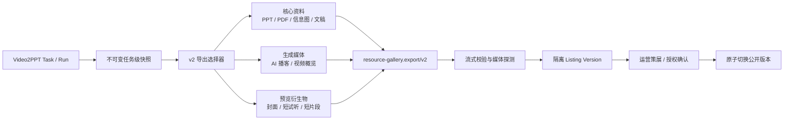
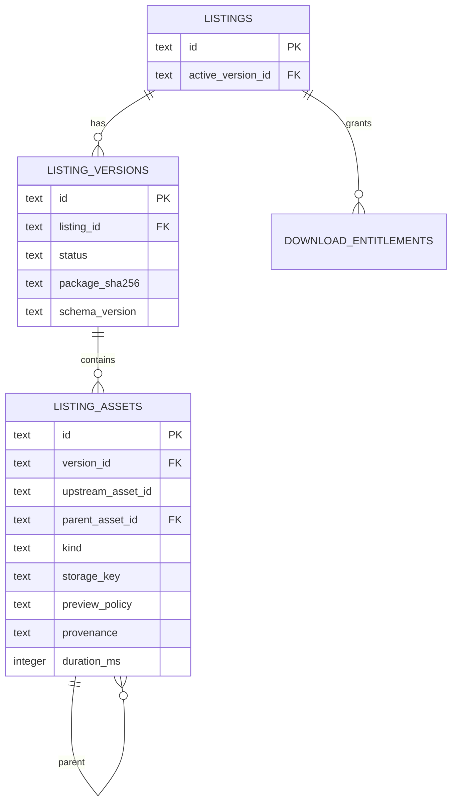
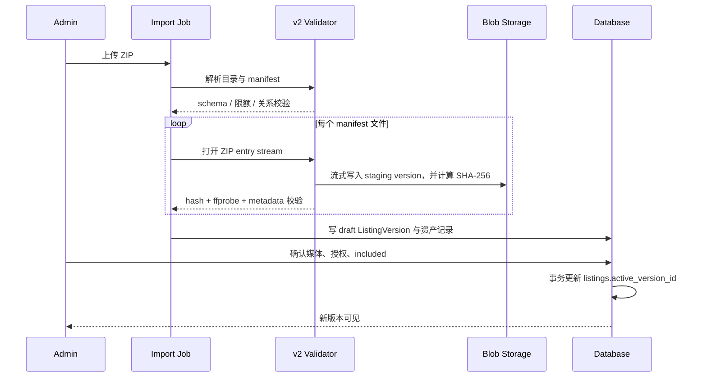

# Resource Gallery 媒体产物导出/导入升级方案

> 日期：2026-08-05
> 状态：M0-M4 代码实现完成，待生产金丝雀与 24 小时灰度观察
> 决策目标：让 Video2PPT 新增的 AI 播客、视频概览及其衍生预览可被安全、可运营地导入 Resource Gallery，同时保持现有 `resource-gallery.export/v1` 可用。

## 1. 结论与范围

应新增 **`resource-gallery.export/v2`**，不要向 v1 直接追加媒体类型。v1 保持只读兼容，仅承载当前的文档和图片类资源；所有新生成媒体经 v2 的隔离版本、媒体校验和权益控制链路进入资源站。

这样做的原因不是枚举扩展本身，而是媒体带来了四个 v1 未建模的事实：

1. `audio_overview` 与 `video_overview` 是可分发的生成内容，来源视频（`video`）不是；两者不能复用同一个类型和公开策略。
2. 单媒体文件已进入数十 MiB 量级，现有“完整 ZIP -> 内存 Buffer -> 再写入”与“多文件全部读入 Buffer 后组 ZIP”会放大内存峰值。
3. 音视频需要 MIME、时长、尺寸、编码、父子关系和预览策略，现有 `listing_files` 无法表达。
4. 未购访客只能访问预览衍生物；对完整媒体开放带 Range 的公共预览接口，能够被分段请求拼出完整内容。

本方案覆盖资源包契约、Video2PPT 导出、资源站校验与存储、Admin 策展、C 端预览/下载、迁移和验收。不改变现有 Credits、定价或作者分成模型；媒体是否免费是运营策略，默认按“完整媒体需 entitlement”实现。

## 2. 现状核查

| 维度 | 已确认事实 | 影响 |
|---|---|---|
| 新产物 | Video2PPT 的 `StudioArtifactType` 已包含 `audio_overview`、`video_overview` | 供给侧已具备媒体类型 |
| 导出器 | `resource_gallery_export.py` 已允许上述 kind，却仍固定输出 `resource-gallery.export/v1` | v1 包含媒体时会被资源站 schema 拒绝 |
| v1 契约 | v1 的 `ArtifactKind` / JSON Schema 不含两种 overview kind | 不应在 v1 上做破坏性补丁 |
| 安全策略 | v1 契约文档要求剥离 `video`、`subtitle`、`auth`，但当前实现只默认剥离 `auth` | 来源视频和字幕可能越过既定边界 |
| 资源站导入 | 校验器 `openZipEntries()` 与导入器均将 ZIP 条目完整聚合为 `Buffer` | 媒体包的内存峰值与包大小线性增长，并发生重复读取 |
| 资源站下载 | 单文件下载已使用流；多文件下载仍 `readFileSync()` 全部文件后在内存组 ZIP | 多媒体下载有 OOM 风险 |
| 预览 | 预览接口对 `is_previewable` 文件支持 Range；现有预览规则没有媒体衍生物边界 | 不能直接把完整 M4A/MP4 标记为可预览 |

相关实现位置：

- Video2PPT：`backend/app/models/task.py`、`backend/app/services/resource_gallery_export.py`
- Resource Gallery：`packages/export-schema/schema/resource-gallery.export.v1.json`、`packages/export-schema/src/validate.ts`、`services/api/src/lib/import.ts`、`services/api/src/routes/downloads.ts`

## 3. 目标架构



### 3.1 不变边界

- 仍然是 **ZIP 离线交换包**；资源站不读取 Video2PPT 的任务目录、数据库或认证信息。
- 仍以 `task_id` 作为同一资源的稳定身份；`run_id`、`source_run_id` 仅用于版本选择和审计，不展示给 C 端。
- v1 历史包不重导、不迁移；v2 导入链路与 v1 显式分流。
- `video` 永远表示来源媒体，v2 导入时默认拒绝；可公开的生成视频必须标为 `video_overview`。
- 来源 URL、NotebookLM ID、下载链接、cookie、token、本机绝对路径不得写入三个 meta 文件或 manifest。

### 3.2 媒体资产分层

| 层 | kind | 用途 | 默认纳入 Listing | 匿名访问 |
|---|---|---|---:|---|
| 核心资料 | `slide_pdf`、`slide_deck`、`infographic`、`content` 等 | 可交付资料 | 是 | 遵循现有文档预览策略 |
| 完整生成媒体 | `audio_overview`、`video_overview` | AI 播客、视频概览 | 否，待运营确认 | 禁止 |
| 预览衍生物 | `preview_audio`、`preview_video`、`poster` | 短试听、短片段、封面 | 否，不计入下载包 | 仅这些文件可公开 |
| 附属文本 | `subtitle` | 生成媒体的字幕 | 否，待运营确认 | 不单独公开 |
| 禁止内容 | `video`、`auth` | 来源视频、认证材料 | 否，导入拒绝或剥离 | 禁止 |

`subtitle` 仅可通过 `parent_asset_id` 附着在 `audio_overview` 或 `video_overview`；不得把来源字幕作为公开资源或替代媒体的字幕。

## 4. v2 交换契约

### 4.1 版本与包结构

```text
manifest.json
task_meta.json
run_meta.json
files/<完整资源与完整媒体>
preview/<poster、preview_audio、preview_video>
```

`manifest.schema_version` 固定为 `resource-gallery.export/v2`。v2 沿用 v1 的任务级恢复链聚合原则，但媒体必须采用单独的主版本选择规则，防止同一任务的所有历史媒体随哈希累积进包。

### 4.2 `assets[]` 字段

v2 以 `assets[]` 取代 v1 的 `files[]`。这样完整交付物和 `preview/` 下的衍生物都能作为有身份、可关联的资产记录，而不再把预览视为无元数据的 ZIP 附件。

```json
{
  "id": "ast_video_01",
  "path": "files/ast_video_01.mp4",
  "name": "AI-agent-video-overview.mp4",
  "kind": "video_overview",
  "sha256": "64-char-hex",
  "size_bytes": 49091489,
  "default_include": false,
  "source_run_id": "ca26737078a942659523cbd425e7063c",
  "provenance": "generated_overview",
  "parent_file_id": null,
  "variant_group_id": "video-overview",
  "media": {
    "mime_type": "video/mp4",
    "duration_ms": 0,
    "width": 0,
    "height": 0,
    "audio_codec": "aac",
    "video_codec": "h264",
    "language": "zh"
  },
  "distribution": {
    "public_preview": "derived_only",
    "entitlement_download": true
  }
}
```

字段约束：

| 字段 | 规则 |
|---|---|
| `id` | 包内唯一；作为 `asset_id` 的上游稳定键，不使用文件名作为身份 |
| `parent_file_id` | `subtitle`、`poster`、`preview_audio`、`preview_video` 必填；指向本包完整媒体 `id` |
| `variant_group_id` | 同一媒体目标的可选显式版本组；未指定时每种目标仅导出一个主版本 |
| `media` | 媒体 kind 必填，必须与服务器 `ffprobe` 结果一致；不接受导出端自报即信任 |
| `distribution.public_preview` | 仅允许 `none` 或 `derived_only`；完整媒体禁止 `full` |
| `distribution.entitlement_download` | 完整媒体应为 `true`；preview/poster 必须为 `false` |
| `default_include` | 完整媒体、字幕和预览衍生物均为 `false`；运营确认后才写入公开版本或下载集合 |

### 4.3 媒体主版本选择

对一个任务的每一种 `variant_group_id`，导出器最多选择一个完整媒体：优先锚点 run 的 `ready + validated` 产物，缺失时回退到同恢复链中最近的已验证产物。同类的旧产物留在 Video2PPT 快照中，但不隐式进入资源站包。

运营确需同时上架多个版本时，应显式传入 `variant_group_id` 并由 Admin 显示为“版本选择”，而不是让导出器基于不同 SHA-256 自动累积。

### 4.4 限额与稳定错误码

首版应以配置控制以下上限：

| 约束 | 初始值 | 失败码 |
|---|---:|---|
| 单个 AI 播客 | 64 MiB | `MEDIA_FILE_TOO_LARGE` |
| 单个视频概览 | 128 MiB | `MEDIA_FILE_TOO_LARGE` |
| 单个预览媒体 | 10 MiB | `PREVIEW_FILE_TOO_LARGE` |
| 总 ZIP 压缩后 | 512 MiB | `PACKAGE_TOO_LARGE` |
| ZIP 解压总量 | 768 MiB | `PACKAGE_UNCOMPRESSED_TOO_LARGE` |
| 媒体时长 | 1 ms 至 2 h | `MEDIA_DURATION_INVALID` |
| 单 kind 完整媒体 | 默认 1 个 | `MEDIA_VARIANT_AMBIGUOUS` |

这些是入口保护值，不是产品容量承诺；运营数据稳定后应基于 P95 包大小与导入耗时调整。

## 5. 安全与权限设计

### 5.1 先修复 v1 的策略漂移

在部署 v2 前，必须让 Video2PPT 和 Resource Gallery 的 v1 策略一致：

1. v1 生产端禁止输出 `audio_overview`、`video_overview`，并把 `video`、`subtitle`、`auth` 及敏感命名文件从默认导出集合移除。
2. v1 消费端将上述 `video`、`subtitle`、`auth` 统一标为 stripped；剥离后无可用文件时拒绝导入。
3. 增加负例：任何带 overview kind 的 v1 manifest 必须失败，不能静默降级为 `video` 或 `other`。

这一步既避免 v1 包被 schema 拒绝，也消除来源视频和生成视频概览混淆的风险。

### 5.2 预览与下载权限矩阵

| 调用者 | poster / preview_* | 完整媒体播放 | 完整媒体下载 | Range |
|---|---:|---:|---:|---:|
| 匿名访客 | 允许 | 禁止 | 禁止 | 仅预览衍生物 |
| 登录未购用户 | 允许 | 禁止 | 禁止 | 仅预览衍生物 |
| 已购用户 | 允许 | 允许 | 允许 | 完整媒体允许 |
| Admin | 允许 | 允许 | 允许 | 允许 |

公开预览 API 的查询条件必须同时满足 `kind in ('poster','preview_audio','preview_video')`、`preview_policy='public'` 与当前 `active_version_id`。不能根据扩展名或宽泛的 `is_previewable` 推断，更不能把完整 M4A/MP4 的 Range 响应暴露给匿名访问者。

### 5.3 媒体完整性检查

导出端和导入端均调用 `ffprobe`，但以导入端结果为准：

- 文件非空、普通文件、路径未逃逸，SHA-256 与 `size_bytes` 一致；
- 容器/MIME 与 kind 的白名单一致：M4A/AAC 用于音频，MP4/H.264 或受控 WebM 用于视频；
- 时长必须为有限正数；视频宽高为正数；拒绝未知、损坏、异常空轨或超限轨道；
- 完整媒体和 `preview_audio` / `preview_video` 均由服务器探测；声明的 MIME、时长、尺寸和编码与探测结果不一致时拒绝，返回 `MEDIA_METADATA_MISMATCH`；`poster` 必须是可解析且尺寸为正数的 PNG/JPEG/WebP；
- 不执行或解析媒体内嵌脚本、封面 URI、外部 URL；仅保存规范化后的元数据。

## 6. Resource Gallery 实施设计

### 6.1 Schema 与校验器

新增 `packages/export-schema/schema/resource-gallery.export.v2.json`，并将 TypeScript 类型改成 v1/v2 判别联合：

```ts
type ExportPackage = ExportManifestV1 | ExportManifestV2;

function validateExportPackage(input: string, options: ValidationOptions): Promise<ValidationResult>;
```

校验分两段：先仅读取 ZIP central directory 与三个小型 JSON 文件确认版本、路径和声明大小；再按已校验的 manifest 逐条打开流、边写入隔离存储边计算 SHA-256。v2 不应返回 `Map<string, Buffer>`，而应返回“已校验条目的流式读取器/临时文件引用”。

需要的 fixtures：最小音频包、最小视频包、带 preview/poster 的合法包、v1 带 overview 的非法包、来源视频、错误父引用、metadata 不一致、零字节媒体、zip bomb、超限媒体、重复 `id` 和跨平台同名文件。

### 6.2 数据模型与迁移

不要在现有 `listing_files` 上原地覆盖。新增版本表，以便导入失败或审核未完成时继续服务旧的公开 Listing：



建议迁移步骤：

1. 新建 `listing_versions`、`listing_assets`，给 `listings` 增加可空 `active_version_id`。
2. 将每个历史 `listing_files` 集合回填为一个 `legacy-v1` active version，完成后保留旧表只读一个发布周期。
3. v1 新导入也写入 version 表，但仍复用 v1 的文件策略；v2 走媒体字段和审核门禁。
4. 所有 C 端读取和下载均通过 `active_version_id`，验证稳定后再移除旧读取路径。

`listing_assets` 至少包含：`upstream_asset_id`、`variant_group_id`、`parent_asset_id`、`kind`、`filename`、`storage_key`、`size_bytes`、`sha256`、`mime_type`、`duration_ms`、`width`、`height`、`audio_codec`、`video_codec`、`language`、`provenance`、`preview_policy`、`included`、`stripped` 和 `source_run_id`。

### 6.3 流式导入和原子发布



实现要求：

- ZIP 上传采用落盘临时文件或对象存储 multipart，不通过应用内存聚合整个请求。
- 每个条目仅允许一个活动写流；哈希计算使用 `Transform`，`ffprobe` 读取 staging 文件后执行。
- 所有 blob 先写到 `staging/<import-job>/<version>/`，失败时只删除该前缀；不得覆盖当前 active blob。
- 元数据、资产记录和 `active_version_id` 的切换在同一数据库事务中完成。导入完成只生成 `draft` version，发布确认才切换 active。
- 基于 `task_id + export_fingerprint`（manifest 规范化内容 + 所有 SHA-256）实现幂等。相同包重复提交返回已有 Import Job/Version；不同包只创建新版本。

### 6.4 下载与媒体服务

1. 单文件完整下载复用现有文件流，但查询必须加入 entitlement、`active_version_id` 与 `included=1`。
2. 多文件下载改为流式 ZIP（如 `archiver`）或异步打包任务，产物落到短期对象存储并返回一次性签名 URL；禁止 `readFileSync` 和 `Buffer.concat` 组包。
3. 完整媒体播放走受控媒体端点，已购用户的 Range 请求由鉴权后转发；权益响应必须使用 `Cache-Control: private, no-store` 并按 Cookie/Authorization 变化，公共预览只读取独立 preview asset。
4. MIME 映射补齐 `.m4a -> audio/mp4`，并保留 `.mp4`、`.webm`、`.mov`。MIME 以导入探测结果保存为准，扩展名只用于下载兜底。
5. C 端使用原生 `<audio controls>` / `<video controls poster>`。完整媒体未授权时只渲染 poster 或 preview asset，不在 HTML 中写入完整媒体 URL。

### 6.5 Admin 策展流程

导入完成后将资产按“核心资料 / AI 播客 / 视频概览 / 概览字幕 / 预览衍生物 / 已剥离”分组，显示大小、时长、编码、来源 run、hash、预览状态和授权确认。

完整媒体初始 `included=false`；运营需要依次确认：媒体可公开分发、已选择正确版本、已生成合规预览（如需要）、权益策略正确。只有这些条件满足时，发布按钮才允许把该资产写入 active version。

## 7. Video2PPT 实施设计

| 模块 | 改动 |
|---|---|
| `resource_gallery_export.py` | 引入 `--schema-version v1|v2`；默认仍为 v1；v2 生成资产 ID、关系、分发字段与媒体 metadata |
| 快照 | 在生成 `audio_overview` / `video_overview` 后用 `ffprobe` 写入质量指标；无效媒体不可进入 export snapshot |
| 媒体选择 | 新增 `--include-media none|curated`、`--anchor-run-id`、`--preview-max-bytes`、`--audio-max-bytes`、`--video-max-bytes`；只输出确定的主版本 |
| 预览生成 | 视频生成 poster 和短视频，音频生成短试听；生成失败不开放公共媒体预览，也不伪造 preview 字段 |
| CLI 报告 | 输出 JSONL：已选/跳过/剥离资产、大小、主版本理由、预览结果、稳定错误码 |
| 回归测试 | 保持 v1 不含 overview；为 v2 建立 4 类任务快照、媒体 metadata、媒体上限和版本选择测试 |

v2 仅从不可变快照读取文件。生成预览的过程也必须写入新的不可变快照或受控的派生物目录，不能在原任务产物上就地覆盖。

## 8. 实施顺序与交付标准

| 里程碑 | 范围 | 主要交付 | 完成门槛 |
|---|---|---|---|
| M0：安全回归 | v1 | v1 双端剥离策略、负例 | overview 无法混入 v1；来源视频/字幕/认证材料不入包 |
| M1：v2 契约与导出 | Schema + Video2PPT | v2 schema、fixtures、主版本选择、ffprobe、预览生成 | 以真实含概览任务生成包，双端 validator 通过 |
| M2：导入与版本存储 | API/DB/Storage | 流式校验、staging、ListingVersion、原子切换 | 导入中断后公开版本不变，峰值内存不随完整包线性翻倍 |
| M3：运营与 C 端 | Admin/Web/Download | 媒体分组、确认门禁、受控播放器、流式/异步下载 | 未购无法读取完整媒体，已购可 Range 播放和下载 |
| M4：同步与灰度 | Sync/Observability | dry-run、review、auto-publish 阶段、指标告警 | 1 音频任务 + 1 视频任务 + 1 混合任务金丝雀稳定后扩大导入 |

### 8.1 金丝雀和回滚

- M1 选取至少一个 AI 播客任务、一个视频概览任务和一个含资料与两种媒体的混合任务。
- M2/M3 只允许 Admin 导入 v2，默认创建 draft，禁止同步器自动发布。
- 每次发布记录 `active_version_id` 变更审计。回滚只需事务性地指回旧 active version，不删除新 staging/version blob。
- 连续 24 小时无导入校验失败、预览越权、下载 5xx 或存储泄漏后，才将同步器从 `dry-run` 提升为 `review`；自动发布需要单独运营确认。

## 9. 验收矩阵

| 场景 | 预期 |
|---|---|
| v1 包含 `audio_overview` / `video_overview` | 生产端过滤；若手工构造则消费端 schema 拒绝 |
| v2 AI 播客导入 | 草稿 version 保存 M4A metadata，完整媒体默认未 included |
| v2 视频概览导入 | Admin 可预览；匿名请求完整 MP4 返回 403，不可通过 Range 拼接 |
| 预览衍生物 | 仅具备正确父引用的 poster/preview 可公开访问 |
| 概览字幕 | 必须关联对应 overview，不作为来源字幕公开 |
| 同类媒体跨多个 run | 按锚点/恢复链规则只选一个主版本；多版本必须显式分组 |
| 体积或时长超限 | 返回稳定错误，不产生可见 ListingVersion 或孤儿 blob |
| 导入过程崩溃 | 当前公开 Listing 继续指向旧 active version |
| 已购用户 | 可播放、Range 与下载完整媒体 |
| 多文件下载 | 测试证明不会读取全部媒体到 Node.js 内存 |
| v1 历史包 | 继续可导入，不触发 v2 media 分支 |

## 10. 风险与待决策

| 决策/风险 | 建议默认值 | 需确认时点 |
|---|---|---|
| 媒体权益 | 完整音视频随 Listing entitlement，非匿名免费 | M2 开始前 |
| 预览时长 | 30–60 秒；由预览生成器裁剪 | M1 开始前 |
| 预览转码 | 首版固定 H.264/AAC + poster；暂不引入多码率 HLS | M1 开始前 |
| 多文件交付 | 首版异步打包，包过期后清理 | M3 开始前 |
| 存储后端 | 开发可本地 staging；生产必须对象存储或等价的版本隔离能力 | M2 开始前 |

不建议的替代方案：直接给 v1 enum 增加两个值、把 `video_overview` 标为普通 `video`、把完整 M4A/MP4 标记为 public preview、继续使用内存 Buffer 导入/组 ZIP、或把来源视频/原始字幕/NotebookLM 地址导出到资源站。

## 11. 本方案与既有计划的关系

- 本文是对 Resource Gallery 现有 `docs/export-contract.md` 和迭代计划的 **v2 增量设计**，不替代 v1 的历史兼容承诺。
- Video2PPT 已有“增量同步”和“NotebookLM 音频/视频概览”实施计划；本文定义两者向资源站交接时必须遵守的交换契约、版本化和权限边界。
- M0 完成前不得产出任何包含 overview 的 v1 包；M2 完成前不得把 v2 媒体自动公开。

## 12. 当前实现与验证记录

截至 2026-08-05，以下交付已落地：

- Video2PPT v1/v2 导出、快照隔离、主媒体选择、`ffprobe` 校验，以及音频试听、视频片段和视频封面派生物生成。
- Resource Gallery v2 schema、ZIP 条目流式校验、隔离 staging、媒体元数据复核、跨平台资产文件名碰撞拒绝、`listing_versions` / `listing_assets` 和发布时原子切换。
- v2 消费端拒绝认证材料、敏感命名资产及默认纳入的字幕；预览衍生物无法被运营接口加入下载集合，字幕不会出现在匿名 Listing 资产清单。v2 指纹覆盖规范化 manifest（排除导出时间和包自带摘要 hash），未声明 ZIP 条目以 `ZIP_UNDECLARED_ENTRY` 拒绝；认证字段覆盖 password/passphrase/access key，绝对路径和外部 URL 均拒绝；v1 继续兼容历史包中的额外预览条目。
- Admin 媒体策展、显式 `variant_group_id` 版本组展示、草稿版本受保护预览（含 Range）、匿名衍生预览、已购完整媒体 Range 播放、单文件流式下载与多文件流式 ZIP 下载。
- 已购 v2 完整媒体的单文件下载 token 校验已切换到当前 `active_version_id` 的 `listing_assets`；poster/试听/视频片段等衍生预览不会被签发为下载目标，并有音频回归覆盖。
- v2 的完整媒体、字幕和预览衍生物在每次新草稿导入时均强制重新策展，不继承同 SHA 旧版本的下载纳入状态；核心文档资产则按已纳入状态恢复既有公开预览策略。Admin 界面将预览衍生物标为仅预览，不再作为下载集合的可选项。
- Admin multipart 上传已使用流式解析器直接落盘，超限、格式错误和导入失败均清理临时文件。

已执行验证：

- Resource Gallery API：50 项测试通过（含真实 MP4 视频概览、视频片段与 poster 的导入、Admin 草稿预览与 Range、匿名限制、公开衍生预览和已购 Range，机器同步的任务 ID/manifest 绑定、自动发布门禁的无资产/删除阈值/核心资产减少边界、受限指标端点、不可解析公开试听拒绝、完整媒体超限和声明元数据不一致的稳定错误码）；元数据阶段拒绝会保留稳定错误码前缀，任务 ID 不匹配会以 `SYNC_TASK_ID_MISMATCH` 在创建版本或 blob 前失败。该套 API 回归另以隔离 MinIO 私有 Bucket 的 S3-compatible 后端运行通过，覆盖 staging multipart 上传、对象复制提升、受控下载与 Range；Export Schema：21 项测试通过（含显式多 `variant_group_id` 版本组、预览分发策略、同一媒体版本组歧义/重复路径、未声明 ZIP 条目、来源 URL/本机路径、零字节媒体拒绝和 v1 流式元数据校验负例）；v2 元数据阶段仅读取受限的三个 JSON，媒体条目逐条流式哈希/落盘；Web 生产构建通过。
- Video2PPT 目标回归：Resource Gallery 导出、同步指纹、消费者元数据预检和 NotebookLM 概览共 66 项测试通过，包含真实可解析 AI 音频试听与视频预览/封面生成，以及完整媒体大小上限从导出/同步 CLI 向服务层的透传。v2 同步器与消费者使用相同的规范化 manifest 指纹：忽略 `exported_at` / `package_sha256`、按资产 ID 排序，其余标题、媒体元数据和分发策略均参与判重；同步 JSONL 记录 `canary_profile`，可由观察器校验三类不同任务。
- 部署前置检查：`deploy/preflight.mjs` 以不回显 Secret 的方式校验生产 HTTPS、S3 私有存储、独立签名密钥及 `production-review` 金丝雀同步门槛；5 项前置检查测试通过，本机配置和占位生产配置均按预期处理。
- 灰度观察工具：`deploy/canary-watch.mjs` 支持 `--once` 连通性验证、默认 24 小时轮询，以及通过一个或多个 `--canary-report` 校验三个不同任务的 `audio` / `video` / `mixed` 成功同步画像；以首次同步指标为基线检测新增失败与 review 超时。同步令牌只能通过 `--token-file` 从权限为 `0600` 或更严格的常规文件读取，拒绝符号链接、环境变量和 `.env` 来源。其 7 项单元测试与前置检查合计 12 项通过；本机 Docker 使用 `--once` 检查时 API 健康、失败计数为 0、门禁异常为 0。
- 本次修复后重新执行 `pnpm lint`、`pnpm build` 和 API 50 项测试均通过，新增 v2 核心文档公开预览、完整媒体重导入重新策展、Admin 无需 checkout 的受控媒体 Range 覆盖，以及完整媒体超限、声明元数据不一致和零字节媒体拒绝覆盖；下载路由进一步按 kind 显式排除完整媒体的扩展名兜底公开预览。本机 Docker 镜像已重建，`/health` 正常，Canary Watch 单次检查无失败，Prometheus `resource-gallery-sync` target 保持 `UP`。
- 浏览器验收：以隔离 v2 媒体夹具启动临时 API/Web 实例，匿名详情页仅呈现 `preview_audio`，真实 M4A 媒体已加载至 `readyState=4` 且无控制台错误；390px 视口无横向溢出，点击资源行后保持正确的活动预览。完整媒体未被纳入时，即使用户已有 entitlement 也返回 403；派生试听仍返回 200。

M4 已实现：受限机器同步接口、服务端同步状态与审计、`review/auto_publish` 门禁、任务级互斥/重试/JSONL 报告、受限 Prometheus 格式指标及无密钥抓取/告警模板，以及 filesystem/S3-compatible multipart Blob 后端。同步器先执行不读取完整媒体的消费者元数据预检，资产 hash 仍由资源站导入时逐条目流式复核。S3 上传先写隔离 staging key，再复制到版本 key；下载继续通过 API 鉴权代理，不产生公开 blob URL。

仍需在真实生产环境完成：配置私有 Bucket/IAM 或等价对象存储、至少一音频任务、一视频任务和一混合任务的金丝雀、指标告警接入，以及连续 24 小时无越权和 5xx 后再将计划任务从 `review` 提升到 `auto_publish`。这些步骤依赖部署凭据和真实任务，不能由本地代码测试替代。

### 12.1 本机 Docker 金丝雀记录（2026-08-05）

- `api`、`web` 与 Prometheus 以 Docker Compose 启动；API healthcheck 通过，Prometheus 的 `resource-gallery-sync` 抓取目标为 `UP`。本地 Prometheus 配置及四条同步告警规则均通过 `promtool` 校验。
- 使用真实 Video2PPT 任务分别生成 AI 播客、视频概览和音视频混合 v2 包；三个包均通过 Resource Gallery 完整校验。三次 `review` 同步均成功导入，`resource_sync_states` 为 3 个 `review`、0 个 `failed`、0 个 `published`。
- 重建 API/Prometheus 容器后再次执行计划同步，三个任务均由服务端指纹识别为 `unchanged`，验证了 SecretProvider、同步器和版本指纹的幂等链路。
- 最新镜像重建后，运行中 SQLite 已确认存在 `listing_assets.variant_group_id`；独立临时 MinIO 的 S3-compatible API 回归 50 项全部通过，覆盖 staging multipart、版本对象复制、受控下载和 Range，测试容器已清理。
- 2026-08-06 再次以当前同步器对三个不同媒体任务执行 run 级 `review` 同步，均成功导入本机 Docker；新版 JSONL 分别判定为 `audio`、`video`、`mixed`，组合报告校验通过。Prometheus 的 `resource-gallery-sync` target 为 `UP`，API `/health` 正常。该次复验仅证明本机环境，不替代生产 24 小时观察。
- 金丝雀过程发现早期快照可能保留来源视频/字幕，导致严格校验阻断 overview 导出。导出器已将新任务级快照迁移至 `video2ppt.task-export-snapshot/v6`；旧运行级快照可用于本地恢复，但 v1/v2 包仍明确剥离来源视频和字幕。旧运行快照中内容相同的不同文件会生成不同、可重复的 v2 `asset_id`。

该记录仅证明本机预生产环境；不构成公网 HTTPS、生产对象存储最小权限或真实用户流量的替代验收。
